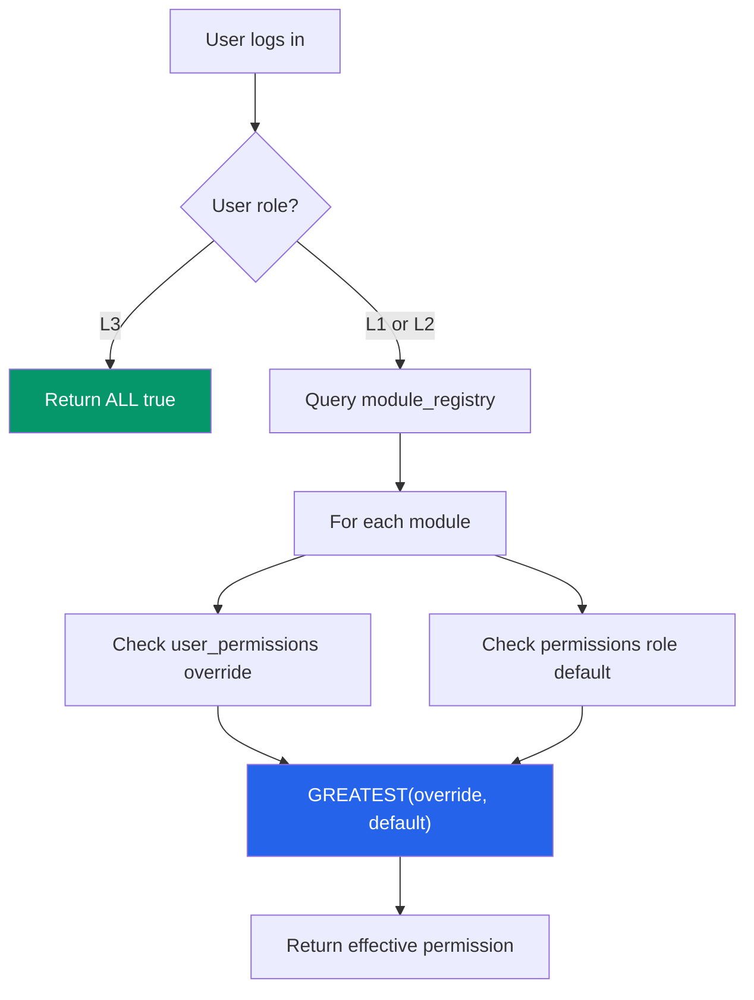

# 🛡️ Granular RBAC — Master Implementation Prompt.

> **Generated**: 2026-02-28 | **System**: Warehouse Management System (WMS)  
> **Status**: Principal Engineer Analysis & Instruction Set

---

## 📋 Table of Contents

1. [System Overview](#1-system-overview)
2. [Current State Audit](#2-current-state-audit)
3. [Business Rules (The Law)](#3-business-rules-the-law)
4. [Architecture Deep Dive](#4-architecture-deep-dive)
5. [What Has Been Implemented](#5-what-has-been-implemented)
6. [What Is Working Correctly](#6-what-is-working-correctly)
7. [Known Issues & Gaps](#7-known-issues--gaps)
8. [Scenarios & Examples](#8-scenarios--examples)
9. [Implementation Checklist](#9-implementation-checklist)
10. [Database Schema Reference](#10-database-schema-reference)
11. [Frontend Architecture Reference](#11-frontend-architecture-reference)
12. [Testing Matrix](#12-testing-matrix)

---

## 1. System Overview

### Role Hierarchy
```
┌─────────────────────────────────────────────────────────────────────┐
│                        L3 — MASTER ADMIN                           │
│  • ONE per application (the system owner)                          │
│  • Full access to EVERYTHING — always, forever                     │
│  • Creates users, assigns roles, configures permissions            │
│  • Defines which modules/screens each L1/L2 user can access       │
│  • Cannot grant permissions to self (anti-escalation)              │
├─────────────────────────────────────────────────────────────────────┤
│                     L2 — SUPERVISOR (N users)                      │
│  • Has its own default permission set (defined in `permissions`)   │
│  • DEFAULT: view/create/edit most modules, NO delete, NO users     │
│  • L3 can RESTRICT which modules L2 sees (module-level control)    │
│  • L3 CANNOT remove L2's default permissions (immutable baseline)  │
│  • L3 CAN add extra permissions beyond L2 defaults                 │
├─────────────────────────────────────────────────────────────────────┤
│                      L1 — OPERATOR (N users)                       │
│  • Has its own default permission set (defined in `permissions`)   │
│  • DEFAULT: view most, create limited, NO edit/delete/users        │
│  • L3 can RESTRICT which modules L1 sees (module-level control)    │
│  • L3 CANNOT remove L1's default permissions (immutable baseline)  │
│  • L3 CAN add extra permissions (e.g., give one L1 user 'create') │
└─────────────────────────────────────────────────────────────────────┘
```

### The Core Principle

```
Effective Permission = Role Default  OR  User Override
                       (immutable)       (additive only)
```

> [!IMPORTANT]
> **Overrides can only ADD permissions, never REMOVE them.**
> If L2 has `items.create = true` by default, no override can make it `false`.
> If L1 has `items.create = false` by default, an override can make it `true`.

---

## 2. Current State Audit

### Database Tables

| Table | Purpose | Status |
|-------|---------|--------|
| `profiles` | User accounts (extends `auth.users`), has `role` column (L1/L2/L3) | ✅ Exists |
| `roles` | Role definitions (L1, L2, L3 with name, description, level) | ✅ Exists |
| `permissions` | **Role-level defaults** — maps [(role_id, module, action) → is_allowed](file:///c:/Users/extra/OneDrive/Desktop/WMS-AE/WarehouseManagementSystem/src/App.tsx#90-1150) | ✅ Exists, populated for all 3 roles |
| `user_permissions` | **Per-user overrides** — maps [(user_id, module_name) → can_view/create/edit/delete](file:///c:/Users/extra/OneDrive/Desktop/WMS-AE/WarehouseManagementSystem/src/App.tsx#90-1150) | ✅ Exists (Migration 001) |
| `module_registry` | Canonical module list with `module_key`, `display_name`, `sort_order` | ✅ Exists (Migration 001) |
| `system_settings` | Feature flag (`permission_source`) for rollout stages | ✅ Exists (Migration 003) |
| `perm_migration_staging` | Temporary table for localStorage → DB migration | ✅ Exists (Migration 003) |
| `audit_log` | Tracks all RBAC operations | ✅ Exists |

### Database Functions

| Function | Purpose | Status |
|----------|---------|--------|
| `get_effective_permissions(user_id)` | Returns merged (role_default OR override) for all modules | ✅ Fixed in Migration 005 — uses GREATEST (OR logic) |
| `check_user_permission(user_id, module, action)` | Single permission check with OR logic | ✅ Fixed in Migration 005 |
| `get_user_role(user_id)` | Returns user's role string | ✅ Exists |
| `has_permission(user_id, module, action)` | Legacy — checks role defaults only (no overrides) | ⚠️ Legacy, not used by granular system |
| `get_user_permissions(user_id)` | Legacy — returns role defaults only | ⚠️ Legacy, not used by granular system |
| `prevent_self_escalation()` | Trigger: blocks L3 from granting to self, blocks non-L3 from modifying | ✅ Exists (Migration 004) |
| `audit_permission_change()` | Trigger: logs all permission changes | ✅ Exists (Migration 001) |
| `advance_permission_rollout(phase)` | Feature flag control | ✅ Exists (Migration 003) |
| `get_permission_source()` | Read feature flag | ✅ Exists (Migration 003) |

### Frontend Files

| File | Purpose | Status |
|------|---------|--------|
| [src/auth/services/permissionService.ts](file:///c:/Users/extra/OneDrive/Desktop/WMS-AE/WarehouseManagementSystem/src/auth/services/permissionService.ts) | DB-backed permission read/write with feature flag | ✅ Implemented |
| [src/auth/services/authService.ts](file:///c:/Users/extra/OneDrive/Desktop/WMS-AE/WarehouseManagementSystem/src/auth/services/authService.ts) | Auth, login, role checks | ✅ Implemented |
| [src/auth/context/AuthContext.tsx](file:///c:/Users/extra/OneDrive/Desktop/WMS-AE/WarehouseManagementSystem/src/auth/context/AuthContext.tsx) | Global auth state, role checks | ✅ Implemented |
| [src/auth/components/GrantAccessModal.tsx](file:///c:/Users/extra/OneDrive/Desktop/WMS-AE/WarehouseManagementSystem/src/auth/components/GrantAccessModal.tsx) | L3 UI for managing user permissions | ✅ Implemented |
| [src/auth/components/ProtectedRoute.tsx](file:///c:/Users/extra/OneDrive/Desktop/WMS-AE/WarehouseManagementSystem/src/auth/components/ProtectedRoute.tsx) | Role-gated route wrapper | ✅ Implemented |
| [src/auth/users/UserManagement.tsx](file:///c:/Users/extra/OneDrive/Desktop/WMS-AE/WarehouseManagementSystem/src/auth/users/UserManagement.tsx) | User CRUD + Grant Access trigger | ✅ Implemented |
| [src/App.tsx](file:///c:/Users/extra/OneDrive/Desktop/WMS-AE/WarehouseManagementSystem/src/App.tsx) | Main router, [canAccessView()](file:///c:/Users/extra/OneDrive/Desktop/WMS-AE/WarehouseManagementSystem/src/App.tsx#142-155), menu filtering | ✅ Implemented |
| [src/components/ItemMasterSupabase.tsx](file:///c:/Users/extra/OneDrive/Desktop/WMS-AE/WarehouseManagementSystem/src/components/ItemMasterSupabase.tsx) | Example module consuming granular perms | ✅ Implemented |

### Feature Flag State (in `system_settings`)

| Phase | Description | Current? |
|-------|-------------|----------|
| `localStorage` | Legacy mode, permissions stored in browser | Unknown |
| `db_with_fallback` | Read from DB, fall back to localStorage on error | **Target** |
| `db_only` | DB is sole source of truth | Future |
| `cleanup_done` | localStorage code removed | Future |

---

## 3. Business Rules (The Law)

### Rule 1: L3 is the Master Admin
- Only **ONE** L3 user per application
- L3 has **full access** to every module, every action — always
- L3 is the ONLY role that can:
  - Create other users
  - Assign roles (L1 or L2)
  - Grant/revoke granular permissions for L1/L2 users
  - View audit logs
  - Access system settings
- `get_effective_permissions()` returns `true` for ALL actions when user is L3

### Rule 2: Overrides Can Only ADD — Never Remove
- The `permissions` table defines **immutable role defaults**
- L2 has `items.edit = true` → an override **cannot** set this to `false`
- L1 has `items.create = false` → an override **can** set this to `true`
- Database enforces this via `GREATEST()` (boolean OR) in `get_effective_permissions`
- Frontend enforces this by: the Grant Access modal shows ONLY user overrides, not role defaults

### Rule 3: Module-Level Access Control
- **Scenario**: L3 has 10 L2 users. User A needs only 2 modules, User B needs 4 modules
- L3 controls this through the **Grant Access modal** — only enabling `view` for the modules that user needs
- **Side effect**: If L2 default has `items.view = true` but L3 wants User A to NOT see items...
  
> [!WARNING]
> **GAP IDENTIFIED**: Currently, the system cannot RESTRICT default permissions. If L2 default is `items.view = true`, all L2 users will see Items regardless of overrides. This is the "module restriction" gap — see [Known Issues](#7-known-issues--gaps).

### Rule 4: Per-User Granular Permissions
- **Scenario**: Out of 10 L1 users, only 1 needs `items.create` permission
- L3 opens Grant Access for that specific L1 user → enables `items.create`
- Other 9 L1 users still have the default (no create)
- The one user gets `effective = L1_default OR override = false OR true = true`

### Rule 5: Permission Actions
The system supports 4 actions per module:
| Action | Key | Description |
|--------|-----|-------------|
| View | `can_view` / `.view` | Can see the module in sidebar + access the page |
| Create | `can_create` / `.create` | Can create new records |
| Edit | `can_edit` / `.edit` | Can modify existing records |
| Delete | `can_delete` / `.delete` | Can remove records |

Some modules have additional actions in the legacy table (`approve`, [export](file:///c:/Users/extra/OneDrive/Desktop/WMS-AE/WarehouseManagementSystem/src/components/ItemMasterSupabase.tsx#165-185)) but the granular system uses only these 4.

### Rule 6: Menu Visibility
- L3: Sees ALL menu items always (+ User Management)
- L1/L2: Sees ONLY modules where they have `view` permission (effective, not override-only)
- If a user has NO `view` permission for a module → the sidebar item is hidden
- The [canAccessView()](file:///c:/Users/extra/OneDrive/Desktop/WMS-AE/WarehouseManagementSystem/src/App.tsx#142-155) function in [App.tsx](file:///c:/Users/extra/OneDrive/Desktop/WMS-AE/WarehouseManagementSystem/src/App.tsx) enforces this

---

## 4. Architecture Deep Dive

### Permission Resolution Flow



### Data Flow: Login → Permission Load

```
1. User enters credentials
2. supabase.auth.signInWithPassword()
3. Fetch profile from profiles table → get role (L1/L2/L3)
4. If L3: skip permission loading (always full access)
5. If L1/L2:
   a. Call getUserPermissions(userId) in permissionService.ts
   b. permissionService checks feature flag (system_settings.permission_source)
   c. If 'db_only' or 'db_with_fallback': Call RPC get_effective_permissions(user_id)
   d. RPC does: GREATEST(user_override, role_default) for each module × action
   e. Returns PermissionMap: { "items.view": true, "items.create": false, ... }
6. PermissionMap stored in App.tsx state as userPerms
7. canAccessView(view) checks userPerms[VIEW_PERMISSION_MAP[view]]
8. getMenuItems() filters sidebar items by canAccessView()
9. Each module component receives userPerms as props
```

### Data Flow: L3 Grants Permission

```
1. L3 opens User Management → clicks "Grant Access" on a user
2. UserManagement calls getUserOverrides(userId) — reads ONLY from user_permissions
3. GrantAccessModal opens with current overrides (NOT role defaults)
4. L3 toggles permissions → clicks Save
5. handleSave() calls saveUserPermissions(userId, overrideMap)
6. permissionService.dbSaveUserPermissions():
   a. Converts PermissionMap to rows (grouped by module)
   b. Rows with ALL false → DELETE from user_permissions (let defaults take over)
   c. Rows with at least one true → UPSERT into user_permissions
7. Database trigger prevent_self_escalation() validates:
   a. Caller is L3
   b. Target is NOT the caller (no self-grant)
   c. Stamps overridden_by and overridden_at
8. Audit trigger logs GRANT_PERMISSION / UPDATE_PERMISSION / REVOKE_PERMISSION
```

### Key Permission Key Format

```
Module without submodules:  "items.view", "items.create", "items.edit", "items.delete"
Module with submodules:     "packing.sticker-generation.view", "packing.packing-details.create"
```

> [!NOTE]
> In the database, the `module_name` in `user_permissions` stores the full module key:
> - `items` (flat module)
> - `packing.sticker-generation` (submodule)
> 
> The action is stored as a column (`can_view`, `can_create`, `can_edit`, `can_delete`).

---

## 5. What Has Been Implemented

### ✅ Fully Working

1. **3-tier role hierarchy** (L1 < L2 < L3) with profiles table
2. **Role default permissions** in `permissions` table for all modules
3. **Per-user override table** (`user_permissions`) with FK constraints
4. **Module registry** with canonical names, display names, sort order
5. **Effective permission resolution** with OR logic (GREATEST) — overrides ADD only
6. **Feature flag rollout engine** (localStorage → db_with_fallback → db_only → cleanup_done)
7. **PermissionService** with feature-flag-aware read/write
8. **Grant Access Modal** — checklist UI for all modules and submodules
9. **Security hardening**:
   - RLS on all granular tables
   - Privilege escalation prevention trigger
   - Self-grant blocking
   - Immutable audit log
10. **Menu filtering** — sidebar hides modules without `view` permission
11. **Module-level access enforcement** — [canAccessView()](file:///c:/Users/extra/OneDrive/Desktop/WMS-AE/WarehouseManagementSystem/src/App.tsx#142-155) in App.tsx
12. **Component-level action enforcement** — `canEdit`, `canDelete` in ItemMasterSupabase

### ⚠️ Partially Working

1. **Grant Access Modal** shows ONLY user overrides (not role defaults) — this is **correct behavior** for the additive-only model
2. **Permission count badges** in UserManagement show override count (may confuse admins who expect to see effective count)

---

## 6. What Is Working Correctly

### OR Logic in Database (Migration 005)

The `get_effective_permissions` function correctly uses `GREATEST()`:

```sql
GREATEST(
  COALESCE(up.can_view, false),              -- user override (or false)
  COALESCE((SELECT p.is_allowed FROM ...),   -- role default (or false)
  false)
)::boolean AS can_view
```

This means:
- If role default = `true` and no override → `GREATEST(false, true) = true` ✅
- If role default = `false` and override = `true` → `GREATEST(true, false) = true` ✅
- If role default = `true` and override = `false` → `GREATEST(false, true) = true` ✅ (override CANNOT remove)
- If role default = `false` and no override → `GREATEST(false, false) = false` ✅

### Frontend Permission Loading

[App.tsx](file:///c:/Users/extra/OneDrive/Desktop/WMS-AE/WarehouseManagementSystem/src/App.tsx) correctly:
1. Skips permission loading for L3 (line 300: `if (data.role !== 'L3')`)
2. Loads effective permissions via [getUserPermissions()](file:///c:/Users/extra/OneDrive/Desktop/WMS-AE/WarehouseManagementSystem/src/auth/services/permissionService.ts#324-351) for L1/L2
3. Stores in `userPerms` state
4. Uses [canAccessView()](file:///c:/Users/extra/OneDrive/Desktop/WMS-AE/WarehouseManagementSystem/src/App.tsx#142-155) for route guards and menu filtering
5. Passes `userPerms` to components for action-level control

### Grant Access Modal

Correctly:
1. Opens with user's **overrides only** (not effective permissions)
2. L3 toggles overrides → saves to `user_permissions` table
3. Only rows with at least one `true` action are upserted
4. All-false rows are deleted (fall back to role default)

---

## 7. Known Issues & Gaps

### 🔴 GAP 1: Module Restriction (Cannot Deny Default Permissions)

**The Problem**: L3 wants L2 User A to see only 2 modules out of 10. But L2 has `view = true` for most modules by default. The current system cannot restrict these defaults.

**Current Behavior**: L2 User A sees ALL modules where `permissions.is_allowed = true`, regardless of what L3 configures.

**Required Behavior**: L3 should be able to control WHICH modules each user sees, even if the role default allows it.

**Proposed Solution**: Introduce a **module access list** concept:
- A new table `user_module_access` mapping [(user_id, module_key) → is_enabled](file:///c:/Users/extra/OneDrive/Desktop/WMS-AE/WarehouseManagementSystem/src/App.tsx#90-1150)
- If a row exists with `is_enabled = false`, the user cannot access that module even if role default allows
- If no row exists for a module, follow normal role defaults
- L3 configures this from the Grant Access modal or a separate "Module Access" tab

**Alternative Solution**: Modify the override logic to support a `deny` mode:
- Add a `mode` column to `user_permissions`: `'grant'` (current behavior) or `'restrict'`
- In `restrict` mode, the override can SET to `false` even if role default is `true`
- This is more flexible but more complex

> [!CAUTION]
> This is the **most critical gap**. Without module restriction, the entire "L3 controls who sees what" requirement cannot be fulfilled for L2 users whose role defaults already include `view = true`.

### 🟡 GAP 2: Sidebar Shows Effective Permissions, Grant Modal Shows Overrides

**The Problem**: After L3 grants overrides to an L1 user, the L1 user sees modules in sidebar based on effective permissions (correct). But the Grant Access modal shows only overrides (also correct). This can confuse L3 admins because:
- They see 5 checkboxes checked in the modal
- But the user actually has access to 8 modules (3 from role defaults + 5 from overrides)

**Impact**: Low. This is a UX clarity issue, not a security issue.

**Proposed Solution**: Show an "Effective Preview" tab or section in the Grant Access modal that shows what the user will ACTUALLY see after saving.

### 🟡 GAP 3: Feature Flag Needs to Be Advanced to `db_only`

**Current State**: The `permission_source` flag may still be on `localStorage` or `db_with_fallback`.

**Action Required**: Run in Supabase SQL Editor:
```sql
SELECT public.advance_permission_rollout('db_only');
```

### 🟢 GAP 4: Missing `approve`/[export](file:///c:/Users/extra/OneDrive/Desktop/WMS-AE/WarehouseManagementSystem/src/components/ItemMasterSupabase.tsx#165-185) Actions in Granular System

The legacy `permissions` table has `approve` and [export](file:///c:/Users/extra/OneDrive/Desktop/WMS-AE/WarehouseManagementSystem/src/components/ItemMasterSupabase.tsx#165-185) actions. The granular `user_permissions` table only has 4 boolean columns: `can_view`, `can_create`, `can_edit`, `can_delete`.

**Impact**: Low. These actions are not heavily used in the frontend. Can be added as columns later if needed.

### 🟢 GAP 5: Module Name Mismatch Between Legacy and Granular

The legacy `permissions` table uses some legacy names (`stock_movements`, `blanket_orders`, etc.) that were normalized in Migration 002. The `module_registry` uses the canonical names (`stock-movements`, `orders`, etc.).

**Status**: Fixed by Migration 002. The `permissions` table has been updated to use canonical names.

### 🔴 GAP 6: Missing Permission Rows in Database (FOUND IN LIVE DATA)

**The Problem**: The live `permissions` table is missing several critical `view` rows for L1 and L2 roles. Without these rows, `get_effective_permissions` returns `false`, hiding modules from the sidebar.

**Missing L1 `view` rows**: `stock-movements`, `orders`, `releases`, `packing.sticker-generation`
**Missing L2 `view` rows**: `stock-movements`, `planning`, `packing.sticker-generation`
**Missing L2 `create` row**: `orders.create`

**Root Cause**: Likely lost during the module name normalization in Migration 002 (e.g., `stock_movements` → `stock-movements`), or never inserted in the original `rbac.sql` seed.

**Fix**: SQL INSERT statements provided in [Section 10 — Database Schema Reference](#10-database-schema-reference).

> [!CAUTION]
> This is a **production data issue** — must be fixed immediately. Without these rows, L1/L2 users may not be able to see modules they should have access to.

---

## 8. Scenarios & Examples

### Scenario 1: L3 Grants Create to Specific L1 User

```
Context: 10 L1 users. By default, L1 cannot create items (items.create = false).
Goal: Give UserA the ability to create items, but not the other 9.

Steps:
1. L3 opens User Management → finds UserA → clicks "Grant Access"
2. Grant Access modal opens (showing only overrides — all unchecked initially)
3. L3 checks "Items → Create" ✅
4. L3 clicks Save
5. System upserts into user_permissions:
   { user_id: UserA, module_name: 'items', can_view: false, can_create: true, can_edit: false, can_delete: false }
6. Next time UserA loads the app:
   - get_effective_permissions returns:
     items.can_create = GREATEST(override=true, default=false) = true ✅
   - UserA sees the "Add Item" button in Item Master

Impact on other 9 L1 users: NONE (they have no override → default = false)
```

### Scenario 2: L2 Users with Different Module Access

```
Context: L3 has 2 L2 users. UserA needs Items + Inventory. UserB needs Items + Packing + Orders + Inventory.

CURRENT BEHAVIOR (WITH GAP):
- Both UserA and UserB see ALL modules where L2 has view=true (which is most modules)
- L3 CANNOT restrict UserA to only Items + Inventory

DESIRED BEHAVIOR (AFTER GAP 1 FIX):
- L3 opens "Module Access" for UserA → unchecks all except Items + Inventory
- L3 opens "Module Access" for UserB → unchecks all except Items + Packing + Orders + Inventory
- UserA sidebar shows: Dashboard, Items, Inventory
- UserB sidebar shows: Dashboard, Items, Packing, Orders, Inventory
```

### Scenario 3: Override Cannot Block Default Permission

```
Context: L2 has items.edit = true by default.
Someone accidentally or intentionally tries to set items.edit = false for L2 UserX.

What happens:
- user_permissions row: can_edit = false for module 'items'
- get_effective_permissions: GREATEST(false, L2_default=true) = true
- UserX can STILL edit items ✅ (default protection works)

This is CORRECT behavior — role defaults are immutable.
```

### Scenario 4: L3 Cannot Be Restricted

```
Context: Someone tries to modify L3's permissions.

What happens:
- get_effective_permissions always returns ALL true for L3 (hardcoded in function)
- prevent_self_escalation trigger blocks L3 from adding overrides to self
- RLS policies prevent non-L3 from touching user_permissions
- ProtectedRoute: L3 always passes role check

L3 is untouchable ✅
```

---

## 9. Implementation Checklist

### Phase 1: Verify Current State ✅ (Already Done)
- [x] Migration 001: `user_permissions` + `module_registry` tables
- [x] Migration 002: Normalize module names in `permissions`
- [x] Migration 003: `system_settings`, feature flag, `get_effective_permissions`
- [x] Migration 004: Security hardening (RLS, escalation prevention)
- [x] Migration 005: Fix OR logic in `get_effective_permissions`
- [x] [permissionService.ts](file:///c:/Users/extra/OneDrive/Desktop/WMS-AE/WarehouseManagementSystem/src/auth/services/permissionService.ts) — feature-flag-aware read/write
- [x] [GrantAccessModal.tsx](file:///c:/Users/extra/OneDrive/Desktop/WMS-AE/WarehouseManagementSystem/src/auth/components/GrantAccessModal.tsx) — checklist UI with module/submodule support
- [x] [App.tsx](file:///c:/Users/extra/OneDrive/Desktop/WMS-AE/WarehouseManagementSystem/src/App.tsx) — [canAccessView()](file:///c:/Users/extra/OneDrive/Desktop/WMS-AE/WarehouseManagementSystem/src/App.tsx#142-155), menu filtering, permission loading
- [x] [ItemMasterSupabase.tsx](file:///c:/Users/extra/OneDrive/Desktop/WMS-AE/WarehouseManagementSystem/src/components/ItemMasterSupabase.tsx) — granular `canEdit`/`canDelete` checks

### Phase 2: Fix Module Restriction Gap (GAP 1) 🔴 TODO
- [ ] Design approach: new table vs. override mode vs. user-module-access
- [ ] Create migration for chosen approach
- [ ] Update `get_effective_permissions` to support module restriction
- [ ] Update Grant Access Modal UI to support module-level on/off
- [ ] Update [canAccessView()](file:///c:/Users/extra/OneDrive/Desktop/WMS-AE/WarehouseManagementSystem/src/App.tsx#142-155) to respect module restrictions
- [ ] Update [getMenuItems()](file:///c:/Users/extra/OneDrive/Desktop/WMS-AE/WarehouseManagementSystem/src/App.tsx#470-498) to filter based on restrictions
- [ ] Test: L2 user restricted to 2 modules
- [ ] Test: L1 user restricted to specific modules

### Phase 3: UI Polish 🟡 TODO
- [ ] Add "Effective Preview" to Grant Access modal
- [ ] Show effective permission count in UserManagement (not just override count)
- [ ] Add visual distinction in Grant Access for "already has via role default"

### Phase 4: Feature Flag Advancement 🟡 TODO
- [ ] Verify `permission_source` is on `db_only`
- [ ] Remove localStorage fallback code paths
- [ ] Set flag to `cleanup_done`

### Phase 5: Propagate Granular Perms to All Modules 🟢 TODO
- [ ] InventoryGrid — pass `userPerms` and enforce create/edit
- [ ] BlanketOrders — pass `userPerms` and enforce CRUD
- [ ] BlanketReleases — pass `userPerms` and enforce CRUD
- [ ] ForecastingModule — pass `userPerms` and enforce create
- [ ] PlanningModule — pass `userPerms` and enforce create
- [ ] StockMovement — already receives `userPerms`, verify enforcement
- [ ] PackingModule submodules — pass `userPerms`, enforce per-submodule

---

## 10. Database Schema Reference

### `permissions` — Role Default Matrix (Immutable)

```sql
CREATE TABLE public.permissions (
  id          uuid PRIMARY KEY DEFAULT uuid_generate_v4(),
  role_id     varchar NOT NULL REFERENCES public.roles(id),
  module      varchar NOT NULL,
  action      varchar NOT NULL,  -- 'view', 'create', 'edit', 'delete'
  is_allowed  boolean DEFAULT true,
  CONSTRAINT permissions_unique UNIQUE (role_id, module, action)
);
```

> [!IMPORTANT]
> **LIVE DATA** — Extracted from production `permissions` table on 2026-02-28.
> `—` = No row exists in DB (defaults to `false` in `get_effective_permissions`).
> ⚠️ = **MISSING ROW** that likely should exist — causes the module to be invisible or action to be blocked.

**COMPLETE L1 Defaults (Operator)** — 35 rows in DB:

| Module | view | create | edit | delete | approve | export |
|--------|------|--------|------|--------|---------|--------|
| dashboard | ✅ | — | — | — | — | — |
| items | ✅ | ❌ | — | — | — | — |
| inventory | ✅ | ✅ | ❌ | — | — | — |
| stock-movements | ⚠️ — | ✅ | — | — | — | — |
| packing.sticker-generation | ⚠️ — | ✅ | ❌ | — | — | — |
| packing.packing-details | ✅ | — | ❌ | — | — | — |
| packing.packing-list-invoice | ✅ | ❌ | — | ❌ | — | — |
| packing.packing-list-sub-invoice | ✅ | ❌ | ❌ | ❌ | — | — |
| orders | ⚠️ — | ❌ | ❌ | ❌ | — | — |
| releases | ⚠️ — | ✅ | ❌ | — | ❌ | — |
| forecast | ✅ | ❌ | — | — | — | — |
| planning | ✅ | ❌ | — | — | — | — |
| users | ❌ | ❌ | — | ❌ | — | — |
| settings | — | — | ❌ | — | — | — |
| reports | ❌ | — | — | — | — | ❌ |
| notifications | ✅ | — | — | — | — | — |

> [!CAUTION]
> **L1 is MISSING `view` rows for**: `stock-movements`, `packing.sticker-generation`, `orders`, `releases`.
> Without these rows, L1 users **cannot see** those modules in the sidebar (unless they have a user override granting view).
> This may be intentional OR a data gap from the normalization migration.

**COMPLETE L2 Defaults (Supervisor)** — 36 rows in DB:

| Module | view | create | edit | delete | approve | export |
|--------|------|--------|------|--------|---------|--------|
| dashboard | ✅ | — | — | — | — | — |
| items | ✅ | ✅ | ✅ | — | — | — |
| inventory | ✅ | ✅ | ✅ | — | — | — |
| stock-movements | ⚠️ — | ✅ | — | — | — | — |
| packing.sticker-generation | ⚠️ — | ✅ | ✅ | — | — | — |
| packing.packing-details | ✅ | ✅ | ✅ | — | — | — |
| packing.packing-list-invoice | ✅ | — | ✅ | — | — | — |
| packing.packing-list-sub-invoice | ✅ | ✅ | — | ❌ | — | — |
| orders | ✅ | — | ✅ | — | — | — |
| releases | ✅ | ✅ | — | — | ✅ | — |
| forecast | ✅ | ✅ | — | — | — | — |
| planning | ⚠️ — | ✅ | — | — | ❌ | — |
| users | ❌ | ❌ | ❌ | ❌ | — | — |
| settings | ❌ | — | ❌ | — | — | — |
| reports | ✅ | — | — | — | — | ✅ |
| notifications | ✅ | — | — | — | — | — |

> [!CAUTION]
> **L2 is MISSING `view` rows for**: `stock-movements`, `packing.sticker-generation`, `planning`.
> Without these rows, L2 users **cannot see** those modules in the sidebar.
> L2 also missing `orders.create` — Supervisors cannot create orders despite having edit.

**COMPLETE L3 Defaults (Manager)** — 29 rows in DB:

| Module | view | create | edit | delete | approve | export |
|--------|------|--------|------|--------|---------|--------|
| dashboard | — | — | — | — | — | — |
| items | — | — | ✅ | — | — | — |
| inventory | ✅ | ✅ | ✅ | — | — | — |
| stock-movements | ✅ | ✅ | — | — | — | — |
| packing.sticker-generation | ✅ | ✅ | ✅ | — | — | — |
| packing.packing-details | ✅ | ✅ | — | — | — | — |
| packing.packing-list-invoice | ✅ | ✅ | ✅ | — | — | — |
| packing.packing-list-sub-invoice | — | ✅ | — | ✅ | — | — |
| orders | ✅ | ✅ | ✅ | ✅ | — | — |
| releases | ✅ | ✅ | — | — | — | — |
| forecast | — | — | — | — | — | — |
| planning | — | ✅ | — | — | ✅ | — |
| users | ✅ | ✅ | — | ✅ | — | — |
| settings | — | — | — | — | — | — |
| reports | ✅ | — | — | — | — | ✅ |
| notifications | — | — | — | — | — | — |

> [!NOTE]
> L3 has many missing rows but this is **NOT a problem** — the `get_effective_permissions` function hardcodes ALL permissions to `true` when the user is L3, completely bypassing the `permissions` table lookup.

### 🔴 NEW GAP 6: Missing Permission Rows in Database

**Critical missing `view` rows that block sidebar access:**

```sql
-- FIX: Insert missing view permissions for L1
INSERT INTO public.permissions (role_id, module, action, is_allowed) VALUES
  ('L1', 'stock-movements', 'view', true),
  ('L1', 'orders', 'view', true),
  ('L1', 'releases', 'view', true),
  ('L1', 'packing.sticker-generation', 'view', true);

-- FIX: Insert missing view permissions for L2
INSERT INTO public.permissions (role_id, module, action, is_allowed) VALUES
  ('L2', 'stock-movements', 'view', true),
  ('L2', 'planning', 'view', true),
  ('L2', 'packing.sticker-generation', 'view', true);

-- FIX: Insert missing create permission for L2
INSERT INTO public.permissions (role_id, module, action, is_allowed) VALUES
  ('L2', 'orders', 'create', true);
```

> [!WARNING]
> **Run these SQL statements in the Supabase SQL Editor** to fix the missing rows.
> Without them, L1/L2 users cannot see certain modules unless they have explicit user overrides.

### `user_permissions` — Per-User Overrides (Additive)

```sql
CREATE TABLE public.user_permissions (
  id            uuid PRIMARY KEY DEFAULT uuid_generate_v4(),
  user_id       uuid NOT NULL REFERENCES public.profiles(id) ON DELETE CASCADE,
  module_name   varchar NOT NULL REFERENCES public.module_registry(module_key),
  can_view      boolean NOT NULL DEFAULT false,
  can_create    boolean NOT NULL DEFAULT false,
  can_edit      boolean NOT NULL DEFAULT false,
  can_delete    boolean NOT NULL DEFAULT false,
  source_role   varchar,
  overridden_by uuid REFERENCES public.profiles(id),
  overridden_at timestamptz,
  created_at    timestamptz NOT NULL DEFAULT now(),
  updated_at    timestamptz NOT NULL DEFAULT now(),
  CONSTRAINT user_permissions_unique UNIQUE (user_id, module_name)
);
```

### `module_registry` — Canonical Module List

```sql
-- Current modules:
dashboard, items, inventory, stock-movements
packing.sticker-generation, packing.packing-details
packing.packing-list-invoice, packing.packing-list-sub-invoice
orders, releases, forecast, planning, users, notifications
```

---

## 11. Frontend Architecture Reference

### Permission Key Format

```typescript
// Flat modules:
"dashboard.view"
"items.view", "items.create", "items.edit", "items.delete"

// Nested (packing submodules):
"packing.sticker-generation.view", "packing.sticker-generation.create"
"packing.packing-details.view", "packing.packing-details.create"
```

### VIEW_PERMISSION_MAP (App.tsx line 125)

```typescript
const VIEW_PERMISSION_MAP: Record<string, string> = {
    'dashboard':                 'dashboard.view',
    'items':                     'items.view',
    'inventory':                 'inventory.view',
    'stock-movements':           'stock-movements.view',
    'packing-sticker':           'packing.sticker-generation.view',
    'packing-details':           'packing.packing-details.view',
    'packing-list-invoice':      'packing.packing-list-invoice.view',
    'packing-list-sub-invoice':  'packing.packing-list-sub-invoice.view',
    'orders':                    'orders.view',
    'releases':                  'releases.view',
    'forecast':                  'forecast.view',
    'planning':                  'planning.view',
    'users':                     'users.view',
};
```

### Module Component Permission Pattern

```typescript
// Example from ItemMasterSupabase.tsx
function ItemMasterSupabase({ userRole, userPerms = {} }: ItemMasterProps) {
    const canAddItem  = userPerms['items.create'] || userRole === 'L2' || userRole === 'L3';
    const canEdit     = userPerms['items.edit']   || userRole === 'L3';
    const canDelete   = userPerms['items.delete'] || userRole === 'L3';
    // ...
    {canAddItem && <AddButton label="Add Item" ... />}
    {canEdit && <EditButton ... />}
    {canDelete && <DeleteButton ... />}
}
```

> [!WARNING]
> The fallback `|| userRole === 'L2'` in `canAddItem` is a **legacy pattern**. Once granular RBAC is fully deployed, permissions should come ONLY from `userPerms` (which already merged role defaults via `get_effective_permissions`). The role fallback duplicates logic and may cause inconsistencies.

### Key Files List

```
src/auth/services/permissionService.ts   — DB read/write, feature flag
src/auth/services/authService.ts         — Login, role checks
src/auth/context/AuthContext.tsx          — Global auth state
src/auth/components/GrantAccessModal.tsx  — Permission UI (1044 lines)
src/auth/components/ProtectedRoute.tsx   — Route guards
src/auth/users/UserManagement.tsx        — User CRUD
src/auth/index.ts                        — Barrel exports
src/App.tsx                              — Main router + canAccessView
.db_reference/rbac.sql                   — Original RBAC schema
.db_reference/migrations/001-006         — Granular RBAC migrations
```

---

## 12. Testing Matrix

### Test Cases for Effective Permission Resolution

| # | User Role | Module | Role Default | User Override | Expected Effective | Test |
|---|-----------|--------|-------------|--------------|-------------------|------|
| 1 | L3 | any | any | any | ✅ true | L3 always full access |
| 2 | L1 | items.view | true | (none) | ✅ true | Role default applies |
| 3 | L1 | items.create | false | (none) | ❌ false | Role default applies |
| 4 | L1 | items.create | false | true | ✅ true | Override ADDS |
| 5 | L2 | items.edit | true | false | ✅ true | Override CANNOT remove |
| 6 | L2 | items.delete | false | true | ✅ true | Override ADDS |
| 7 | L2 | users.view | false | (none) | ❌ false | L2 cant see user mgmt |
| 8 | L1 | users.view | false | true | ✅ true | Override gives access |

### Test Cases for UI Flow

| # | Scenario | Expected |
|---|----------|----------|
| 1 | L3 logs in | Sees all menu items + User Management |
| 2 | L1 logs in (no overrides) | Sees only modules with `view=true` in L1 defaults |
| 3 | L1 with `items.create` override logs in | Sees "Add Item" button in Item Master |
| 4 | L2 logs in (no overrides) | Sees all modules with `view=true` in L2 defaults |
| 5 | L3 opens Grant Access for L1 | Modal shows ONLY overrides (not role defaults) |
| 6 | L3 grants `items.create` to L1, saves | `user_permissions` row created with `can_create=true` |
| 7 | L3 unchecks all for a user, saves | `user_permissions` rows deleted for that user |
| 8 | L3 tries to grant self permissions | Blocked by `prevent_self_escalation` trigger |
| 9 | L2 tries to modify permissions | Blocked by RLS + escalation trigger |

---

> [!TIP]
> **For the next implementation conversation**, paste this entire document as context. It contains:
> - Complete understanding of what exists
> - Exact file paths and line numbers
> - The specific gap that needs fixing (#GAP 1: Module Restriction)
> - Test matrix to verify changes
> - Architecture diagrams for visual understanding
