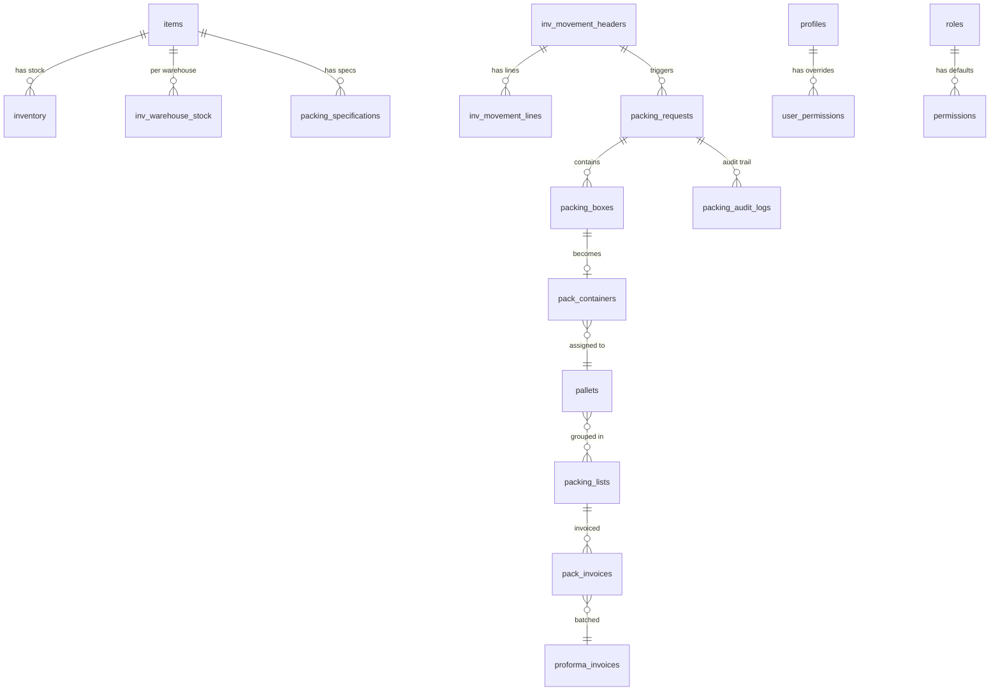

# Database Schema Reference

> **Version:** 0.5.5 | **Last Updated:** 2026-04-25
> **Full Schema:** See `.db_reference/presentschema.sql` for the complete SQL definition.

## Table Groups

### 1. Item Management

| Table | Purpose | Key Columns |
|-------|---------|-------------|
| `items` | Master item catalog | `part_number` (unique since 0.5.4), `item_code` (legacy), `item_name`, `master_serial_no`, `is_active` |
| `inventory` | Aggregate stock levels | `item_code`, `current_stock`, `allocated_stock`, `available_stock` |

> **0.5.4 schema migration:** dependent tables now carry a populated `part_number_new` column with FK to `items.part_number`. Legacy `item_code` columns retained until a verified backup exists. See [`SCHEMA_MIGRATION_item_code_to_part_number.md`](SCHEMA_MIGRATION_item_code_to_part_number.md).

### 2. Warehouse & Stock

| Table | Purpose | Key Columns |
|-------|---------|-------------|
| `warehouses` | Warehouse definitions | `warehouse_code`, `warehouse_name`, `location_type` |
| `inv_warehouse_stock` | Per-warehouse item stock | `warehouse_id`, `item_code`, `quantity_on_hand` |
| `inv_stock_ledger` | Stock transaction history | `warehouse_id`, `item_code`, `transaction_type`, `quantity_change` |

### 3. Stock Movements

| Table | Purpose | Key Columns |
|-------|---------|-------------|
| `inv_movement_headers` | Movement requests | `movement_number`, `movement_type`, `status`, `source_warehouse_id` |
| `inv_movement_lines` | Movement line items | `movement_header_id`, `item_code`, `quantity` |
| `reason_codes` | Movement reason codes | `reason_code`, `category`, `description` |

### 4. Packing Workflow

| Table | Purpose | Key Columns |
|-------|---------|-------------|
| `packing_requests` | Packing work orders | `movement_header_id`, `item_code`, `total_packed_qty`, `status` |
| `packing_boxes` | Individual packed boxes | `packing_request_id`, `packing_id`, `box_qty`, `sticker_printed` |
| `packing_specifications` | Item packing rules | `item_code`, `inner_box_quantity`, `outer_box_quantity` |
| `packing_audit_logs` | Packing operation audit | `packing_request_id`, `action_type`, `performed_by` |

### 5. Packing Engine

| Table | Purpose | Key Columns |
|-------|---------|-------------|
| `pack_contract_configs` | Customer packing configs | `item_id`, `contract_outer_qty`, `inner_box_qty` |
| `pack_containers` | Packed containers | `container_number`, `pallet_id`, `item_code`, `quantity` |
| `pallets` | Pallet tracking | `pallet_number`, `item_code`, `state`, `current_qty`, `target_qty` |
| `pallet_containers` | Pallet-container junction | `pallet_id`, `container_id` |
| `pallet_state_log` | Pallet state transitions | `pallet_id`, `from_state`, `to_state`, `trigger_type` |

### 6. Dispatch & Invoicing

| Table | Purpose | Key Columns |
|-------|---------|-------------|
| `packing_lists` | Packing list headers | `packing_list_number`, `status`, `total_pallets` |
| `pack_invoices` | Commercial invoices | `invoice_number`, `packing_list_id`, `total_amount` |
| `proforma_invoices` | Proforma invoices | `proforma_number`, `status`, `stock_movement_id` |
| `master_packing_lists` | MPL headers | `mpl_number`, `status`, `dispatch_date` |
| `mpl_pallets` | MPL pallet assignments | `mpl_id`, `pallet_id` |

### 7. Customer Agreements & Releases (added in 0.5.5)

| Table | Purpose | Key Columns |
|-------|---------|-------------|
| `customer_agreements` | BPA / SPOT / PO headers | `agreement_number`, `agreement_revision`, `agreement_type` (`BPA \| SPOT`), `status`, `customer_code`, `effective_*`, `source` |
| `customer_agreement_parts` | Per-part lines on a BPA | `agreement_id`, `line_number`, `part_number`, `blanket_quantity`, `unit_price`, `release_multiple`, `min/max_warehouse_stock`, `source` (`MANUAL \| MIGRATION \| MIGRATION_INFORMAL \| MIGRATION_PLACEHOLDER`) |
| `customer_agreement_revisions` | Append-only amendment snapshots | `agreement_id`, `revision_number`, `change_type`, `change_summary` |
| `blanket_orders` | Operational mirror (legacy bridge) | `order_number`, `customer_name`, `total_value` |
| `blanket_order_lines` | Operational mirror line items | `blanket_order_id`, `item_code`, `quantity` |
| `blanket_order_line_configs` | Running-totals row per line | `agreement_id`, `part_number`, `released_quantity`, `delivered_quantity`, `total_releases`, `total_sub_invoices` |
| `blanket_releases` | Customer-PO releases | `agreement_id`, `release_number`, `release_sequence`, `customer_po_base`, `requested_quantity`, `need_by_date`, `status` (`OPEN \| FULFILLED \| CANCELLED`), `source` |
| `release_pallet_assignments` | Resolved pallet → release | `blanket_release_id`, `pallet_id`, `part_number`, `qty` |

### 8. Release Allocation Holds (added in 0.5.5)

| Table | Purpose | Key Columns |
|-------|---------|-------------|
| `release_pallet_holds` | Per-release pallet locks | `release_id`, `pallet_id`, `hold_type` (`ALLOCATED \| RESERVED`), `scope_part_number`, `scope_warehouse_id`, `qty` |

Holds drive the four-bucket inventory view (`vw_item_stock_distribution`):
`On-Hand · Allocated · Reserved · Available`. `ALLOCATED` is exclusive to the
earliest-need-by release in scope; later competing releases accrue as
`RESERVED`. Holds drain only when the linked release flips to `DELIVERED`
(`trg_br_delivered_drain_holds`).

### 9. Sub-Invoices, Tariff & Inbound Receiving (added in 0.5.5)

| Table | Purpose | Key Columns |
|-------|---------|-------------|
| `pack_sub_invoices` | Customer billing per release | `sub_invoice_number`, `blanket_release_id`, `agreement_id`, `total_quantity`, `total_pallets`, `status` |
| `pack_sub_invoice_lines` | Per-part breakdown of a sub-invoice | `sub_invoice_id`, `parent_invoice_line_id`, `part_number`, `quantity`, `unit_price` |
| `tariff_invoices` | US tariff claim queue | `tariff_invoice_number`, `sub_invoice_id`, `unit_tariff`, `total_tariff`, `status` (`DRAFT → SUBMITTED → CLAIMED → PAID`) |
| `goods_receipts` | Per-MPL inbound GR | `gr_number`, `proforma_invoice_id`, `mpl_id`, `total_pallets_*`, `status` |
| `goods_receipt_lines` | Per-pallet GR line | `gr_id`, `pallet_id`, `received_qty`, `line_status` (`RECEIVED \| DAMAGED \| SHORT \| QUALITY_HOLD`), `rack_location_code` |
| `warehouse_rack_locations` | Physical rack-cell occupancy | `rack`, `location_number`, `pallet_id`, `agreement_id`, `part_number` |
| `proforma_invoice_mpls` | Proforma ↔ MPL junction | `proforma_id`, `mpl_id`, `total_pallets`, `total_quantity` |
| `demand_forecasts` | Demand predictions | `item_code`, `forecast_date`, `forecast_quantity` |
| `demand_history` | Historical demand | `item_code`, `period`, `actual_quantity` |
| `planning_recommendations` | MRP suggestions | `item_code`, `recommendation_type`, `quantity` |

### 8. Authentication & RBAC

| Table | Purpose | Key Columns |
|-------|---------|-------------|
| `profiles` | User profiles | `id`, `full_name`, `role`, `is_active` |
| `roles` | Role definitions | `id` (L1/L2/L3), `name`, `level` |
| `permissions` | Role default permissions | `role_id`, `module`, `action`, `is_allowed` |
| `user_permissions` | Per-user overrides | `user_id`, `module_name`, `can_view`, `can_create` |
| `module_registry` | Module catalog | `module_key`, `display_name`, `parent_module` |
| `audit_log` | Security audit trail | `user_id`, `action`, `target_type`, `old_value`, `new_value` |

## Performance Indexes (v0.4.1)

| Index | Table | Columns | Purpose |
|-------|-------|---------|---------|
| `idx_packing_boxes_request_id` | `packing_boxes` | `packing_request_id` | Box lookup by request |
| `idx_packing_boxes_printed_transferred` | `packing_boxes` | `packing_request_id, sticker_printed, is_transferred` | Sticker/transfer eligibility |
| `idx_pack_containers_item_code` | `pack_containers` | `item_code` | Container lookup by item |
| `idx_pack_containers_pallet_id` | `pack_containers` | `pallet_id` | Container lookup by pallet |
| `idx_pallets_item_state` | `pallets` | `item_code, state` | Pallet impact calculation |
| `idx_packing_specs_item_active` | `packing_specifications` | `item_code, is_active` | Spec lookup |
| `idx_warehouse_stock_lookup` | `inv_warehouse_stock` | `warehouse_id, item_code, is_active` | Stock lookup |
| `idx_stock_ledger_warehouse_item` | `inv_stock_ledger` | `warehouse_id, item_code` | Ledger queries |
| `idx_packing_audit_request` | `packing_audit_logs` | `packing_request_id` | Audit log lookup |
| `idx_packing_requests_status_created` | `packing_requests` | `status, created_at` | Filtered list queries |

## Key Functions

| Function | Purpose | Security |
|----------|---------|----------|
| `get_effective_permissions(user_id)` | Resolve merged permissions for a user | `SECURITY DEFINER` |
| `check_user_permission(user_id, module, action)` | Check single permission | `SECURITY DEFINER` |
| `set_updated_at()` | Auto-update `updated_at` timestamp | Trigger function |
| `audit_permission_change()` | Log permission modifications | `SECURITY DEFINER` |

## Entity Relationships

