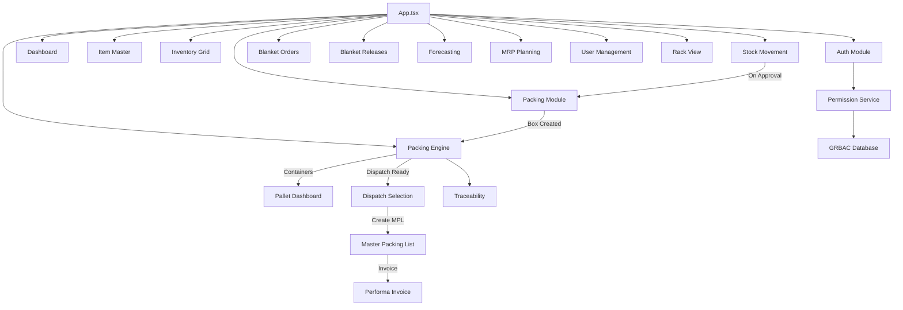

# Module Overview

> **Version:** 0.5.5 | **Last Updated:** 2026-04-25

## Module Dependency Map

## Module Details

### Core Modules

| Module | File | Size | Dependencies |
|--------|------|------|-------------|
| App Shell | `App.tsx` | 66KB | All modules |
| Dashboard | `DashboardNew.tsx` | 16KB | `useDashboard` hook |
| Item Master | `ItemMasterSupabase.tsx` | 77KB | Supabase client, GRBAC |
| Inventory Grid | `InventoryGrid.tsx` | 42KB | `inventoryService` |
| Stock Movement | `StockMovement.tsx` | 178KB | `packingService`, `packingEngineService` |

### Packing Module (v5)

| Component | File | Purpose |
|-----------|------|---------|
| Packing Module | `PackingModule.tsx` | Main packing workflow UI |
| Packing Details | `PackingDetails.tsx` | Specification management |
| Packing Detail | `PackingDetail.tsx` | Single request detail view |
| Sticker Print | `StickerPrint.tsx` | QR code sticker generation |
| Packing List | `PackingList.tsx` | Packing list view |
| Packing Service | `packingService.ts` | Workflow logic + stock transfer |

### Packing Engine

| Component | File | Purpose |
|-----------|------|---------|
| Pallet Dashboard | `PalletDashboard.tsx` | Pallet state tracking |
| Contract Config | `ContractConfigManager.tsx` | Customer packing rules |
| Dispatch Selection | `DispatchSelection.tsx` | Dispatch readiness + MPL creation |
| MPL Home | `MasterPackingListHome.tsx` | Master packing list management |
| Packing List Print | `PackingListPrint.tsx` | Packing list print layout |
| Performa Invoice | `PerformaInvoice.tsx` | Shipment batching |
| Traceability | `TraceabilityViewer.tsx` | Full backward trace |
| Engine Service | `packingEngineService.ts` | Container/pallet/PL logic |
| MPL Service | `mplService.ts` | MPL CRUD + dispatch |
| Packing List Manager | `PackingListManager.tsx` | Packing list CRUD + workflow |

### Customer-Facing Workflow Modules (added in 0.5.5)

| Module | File | Purpose |
|--------|------|---------|
| BPA List | `bpa/BPAList.tsx` | Customer agreement portfolio with fulfillment dashboard, cancel, expiry alerts |
| BPA Detail / Create / Amend | `bpa/BPADetail.tsx`, `BPACreate.tsx`, `BPAAmend.tsx` | Per-BPA detail with revisions, line-level edits, document upload |
| Release List | `release/ReleaseList.tsx` | Drafted / Completed / Cancelled releases with sub-invoice progress |
| Create Release | `release/CreateRelease.tsx` | Wizard: BPA pick → pallet selection → allocate-holds → sub-invoice |
| Tariff Invoice Queue | `release/TariffInvoiceQueue.tsx` | Finance queue: DRAFT → SUBMITTED → CLAIMED → PAID |
| Inbound Receiving | `rack-view/RackViewGrid.tsx`, `ReceiveShipmentScreen.tsx` | Per-MPL goods-receipt with discrepancy tracking |
| Rack Storage | `RackView.tsx`, `rack-view/RackCellDrawer.tsx` | Visual rack-cell view with pallet back-chain |
| Pack Engine — Pallet | `packing-engine/PalletDashboard.tsx` | Pallet state machine across packing → dispatch → 3PL → release |

### Support Modules

| Module | File | Purpose |
|--------|------|---------|
| Blanket Orders | `BlanketOrders.tsx` | Legacy view (mirror of customer_agreements) |
| Blanket Releases | `BlanketReleases.tsx` | Legacy view of releases |
| Forecasting | `ForecastingModule.tsx` | Demand prediction |
| MRP Planning | `PlanningModule.tsx` | Replenishment planning |
| Stock Distribution Card | `StockDistributionCard.tsx` | 4-bucket inventory (`On-Hand / Allocated / Reserved / Available`) — added in 0.5.5 |
| Rack View | `RackView.tsx` | Visual warehouse layout |
| Notifications | `NotificationBell.tsx` | Notification system |

### Shared Services

| Service | File | Purpose |
|---------|------|---------|
| Auth Utilities | `utils/auth.ts` | Shared auth helpers |
| Audit Logger | `utils/auditLogger.ts` | Structured logging |
| ID Generator | `utils/idGenerator.ts` | UUID + packing ID generation |
| Supabase Client | `utils/supabase/client.tsx` | Singleton Supabase client |
| Supabase Auth | `utils/supabase/auth.ts` | Authentication functions |
| Inventory Service | `services/inventoryService.ts` | Inventory data access |
| Permission Service | `auth/services/permissionService.ts` | GRBAC resolution |
| PDF Service Client | `services/pdfServiceClient.ts` | PDF microservice client with fallback |
| Session Service | `services/sessionService.ts` | Session persistence management |
| Paginated Data Hook | `hooks/usePaginatedData.ts` | Server-side pagination hook |

## Data Flow

### Stock Movement → Packing → Dispatch

1. **L1 Operator** creates stock movement request (PENDING)
2. **L2 Supervisor** reviews and approves/rejects
3. On approval: **Packing Request** auto-created
4. Operator opens packing → **boxes auto-generated** from specification
5. Each box gets **QR-coded sticker** (PKG-XXXXXXXX)
6. Stickers printed → operator can **transfer stock to FG warehouse**
7. Boxes grouped into **containers**, containers into **pallets**
8. Ready pallets appear in **Dispatch Selection**
9. Pallets selected → **Master Packing List** created
10. MPL confirmed → **Performa Invoice** generated
11. Invoice approved → **stock dispatched** to In-Transit
