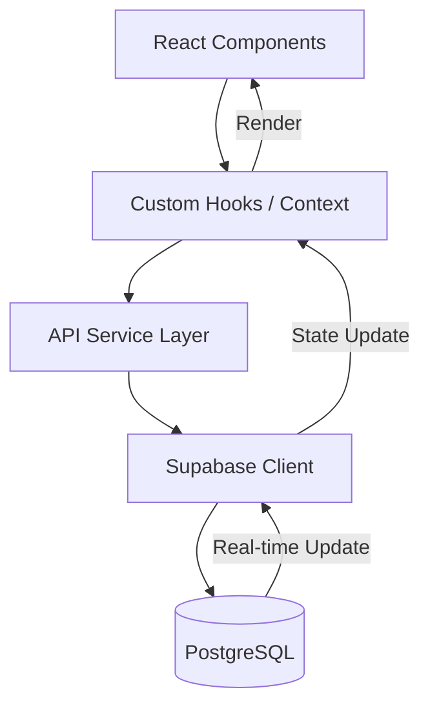

# 🏗️ System Architecture

This document provides a deep dive into the technical architecture of the Warehouse Management System (WMS).

## 🗄️ System Design Principles

The WMS architecture is designed around several core pillars:

1.  **Modularity**: Components are decoupled, allowing for independent scaling and testing.
2.  **Type Safety**: Leveraging TypeScript to ensure data consistency across the entire application.
3.  **Real-time Synchronization**: Using Supabase's real-time capabilities to keep stock levels synchronized across all clients.
4.  **Auditability**: Every stock movement is recorded in a ledger, ensuring a permanent and immutable history.

## 📊 Data Flow Architecture

The data flow follows a unidirectional pattern to minimize state inconsistencies:

### Flow Breakdown:
- **API Flow**: Component triggers a hook → Hook calls a service method → Service communicates with Supabase/Backend.
- **Auth Flow**: Supabase Auth handles JWT issuance → Client stores token → Every subsequent request is signed with the Authorization header.
- **Stock Update Flow**: A transaction (e.g., blanket release) is completed → Database trigger fires → Stock levels are recalculated → Ledger entry is created → Real-time event is broadcasted.

## 🧩 Core Modules

### 1. Item Master & Inventory
- **Schema**: Centralized `items` table linked to `inventory` levels.
- **Logic**: Strict relational integrity ensures that inventory cannot exist for non-existent items.

### 2. Stock Movement Ledger
- **Function**: Records Every `IN` and `OUT` transaction.
- **Security**: Logic is enforced at the database level to prevent manual tampering of stock levels without a corresponding ledger entry.

### 3. Forecasting Engine
- **Algorithm**: Holt-Winters Triple Exponential Smoothing.
- **Computation**: Processes `demand_history` to generate `demand_forecasts` considering level, trend, and seasonality.

### 4. MRP Planning Logic
- **Input**: Current Stock + Open Orders + Forecasts + Lead Times.
- **Output**: Actionable replenishment recommendations with priority levels.

## 🔐 Security Architecture

- **Authentication**: Google/Microsoft style Auth via Supabase.
- **Authorization**: Row Level Security (RLS) in PostgreSQL ensures users only access data they are authorized to see.
- **Data Protection**: Sensitive environment variables are managed via Vite's `.env` mechanism and never committed to source control.

## 🚀 Deployment Architecture

The application is optimized for cloud deployment:
- **Frontend**: Statistically optimized assets served via CDN (e.g., Vercel / Netlify).
- **Backend**: Serverless architecture using Supabase Edge Functions for complex business logic.
- **Database**: Managed PostgreSQL instance with automated backups and point-in-time recovery.

---

**Last Updated**: February 2026  
**Document Owner**: Architecture Team / Principal Engineer
