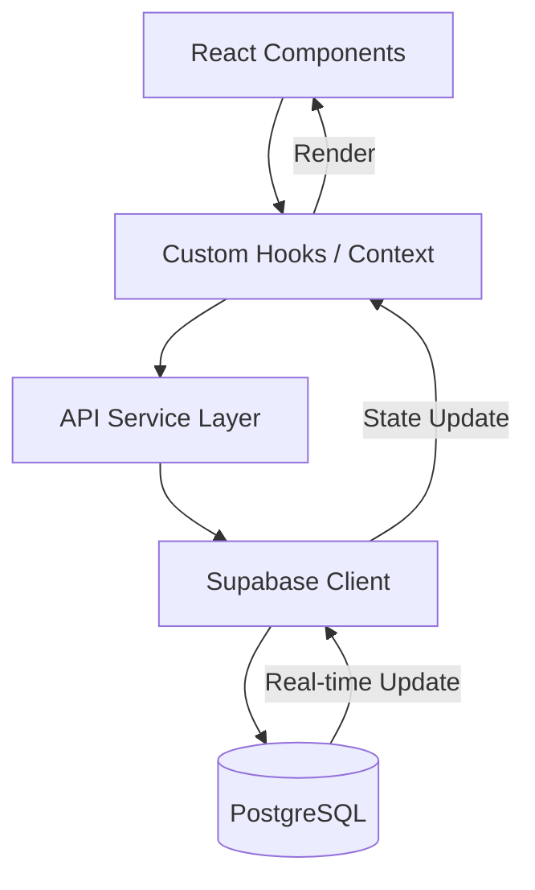

# 🏗️ System Architecture

> **Version:** 0.4.0 | **Last Updated:** March 2026

This document provides a deep dive into the technical architecture of the Warehouse Management System (WMS).

## 🗄️ System Design Principles

The WMS architecture is designed around several core pillars:

1.  **Modularity**: Components are decoupled, allowing for independent scaling and testing.
2.  **Type Safety**: Leveraging TypeScript to ensure data consistency across the entire application.
3.  **Real-time Synchronization**: Using Supabase's real-time capabilities to keep stock levels synchronized across all clients.
4.  **Auditability**: Every stock movement is recorded in a ledger, ensuring a permanent and immutable history.
5.  **Granular RBAC**: Database-backed permission engine replaces hardcoded role checks, enabling per-user permission overrides.
6.  **Performance First**: Parallel data fetching, in-memory caching, and zero-overhead permission checks.

## 📊 Data Flow Architecture

The data flow follows a unidirectional pattern to minimize state inconsistencies:

```mermaid
graph TD
    UI[React Components] --> Hooks[Custom Hooks / Context]
    Hooks --> Service[API Service Layer]
    Service --> Client[Supabase Client]
    Client --> DB[(PostgreSQL)]
    DB -- Real-time Update --> Client
    Client -- State Update --> Hooks
    Hooks -- Render --> UI
```

### Flow Breakdown:
- **API Flow**: Component triggers a hook → Hook calls a service method → Service communicates with Supabase/Backend.
- **Auth Flow**: Supabase Auth handles JWT issuance → Client stores token → Profile + Permissions load in parallel → Every subsequent request is signed with the Authorization header.
- **Permission Flow**: `App.tsx` → `getUserPermissions()` → `permissionService.ts` reads feature flag → RPC `get_effective_permissions()` → Flat `PermissionMap` → Components check `userPerms['module.action']`.
- **Stock Update Flow**: A transaction (e.g., blanket release) is completed → Database trigger fires → Stock levels are recalculated → Ledger entry is created → Real-time event is broadcasted.

## 🧩 Core Modules

### 1. Item Master & Inventory
- **Schema**: Centralized `items` table linked to `inventory` levels via multi-warehouse views.
- **Logic**: Strict relational integrity ensures that inventory cannot exist for non-existent items.

### 2. Stock Movement Ledger
- **Function**: Records every `IN` and `OUT` transaction via `inv_movement_headers` and `inv_movement_lines`.
- **Security**: Logic is enforced at the database level to prevent manual tampering of stock levels without a corresponding ledger entry.
- **Approval Flow**: L1 creates → L2/L3 approves (partial/full) → Stock transferred.

### 3. Forecasting Engine
- **Algorithm**: Holt-Winters Triple Exponential Smoothing.
- **Computation**: Processes `demand_history` to generate `demand_forecasts` considering level, trend, and seasonality.

### 4. MRP Planning Logic
- **Input**: Current Stock + Open Orders + Forecasts + Lead Times.
- **Output**: Actionable replenishment recommendations with priority levels.

### 5. Packing Module
- **Workflow**: Movement Approved → Packing Request → Box Creation (PKG-XXXXXXXX) → Sticker Generation → Stock Transfer.
- **Stock Transfer**: Partial and complete stock transfers from Production to FG Warehouse.
- **Audit**: Full packing audit trail with human-readable metadata.
- **Sticker**: Barcode-enabled stickers with item details, box numbers, and PKG identifiers.

### 6. Notifications
- **Bell**: Real-time notification bell in the top bar with unread count.
- **Alerts**: Stock alerts, approval requests, and system events.

### 7. Granular RBAC (v0.4.0)
- **Engine**: `permissionService.ts` reads DB-backed permissions via `get_effective_permissions()` RPC.
- **Grant Access Modal**: L3 managers can grant/restrict specific create/edit/delete permissions per user per module.
- **Feature Flag**: `system_settings.permission_source` controls rollout stage (`db_only` in production).
- **Caching**: In-memory permission cache (60s TTL) + permission source cache (5-min TTL) to minimize DB calls.
- **Components**: `ItemMasterSupabase`, `StockMovement`, `PackingDetails` all check `userPerms['module.action']`.

## ⚡ Performance Architecture (v0.4.0)

### Parallel Data Fetching
- **Auth startup**: Profile + permissions fetched via `Promise.allSettled()` (eliminates sequential waterfall)
- **Dashboard**: Stock view + blanket orders via `Promise.all()` (two parallel queries)
- **StockMovement**: Headers → (lines + profiles in parallel) → items

### Caching Strategy
| Cache | TTL | Purpose |
|-------|-----|---------|
| Permission source | 5 min | Avoid re-reading `system_settings` on every permission check |
| User permissions | 60s | Avoid re-calling `get_effective_permissions()` on every navigation |
| Supabase client | Singleton | Prevent duplicate auth contexts |

### Console Output Optimization
- All debug `console.log` statements removed from production code paths
- Only `console.error` retained for actual errors
- Eliminates browser console overhead during normal operation

## 🔐 Security Architecture

- **Authentication**: JWT-based Auth via Supabase with automatic token refresh.
- **Authorization**: Granular RBAC via `user_permissions` table + `get_effective_permissions()` function.
- **Row Level Security**: RLS policies on all Supabase tables enforce data access at the database level.
- **Data Protection**: Sensitive environment variables are managed via Vite's `.env` mechanism and never committed to source control.
- **Mutable Search Path**: Fixed on all 27+ database functions to prevent search path hijacking.

## 🚀 Deployment Architecture

The application is optimized for cloud deployment:
- **Frontend**: Statically optimized assets served via CDN (e.g., Vercel / Netlify).
- **Backend**: Serverless architecture using Supabase Edge Functions for complex business logic.
- **Database**: Managed PostgreSQL instance with automated backups and point-in-time recovery.

---

**Last Updated**: March 2026  
**Document Owner**: Architecture Team / Principal Engineer  
**Version**: 0.4.0 (Granular RBAC + Performance)
