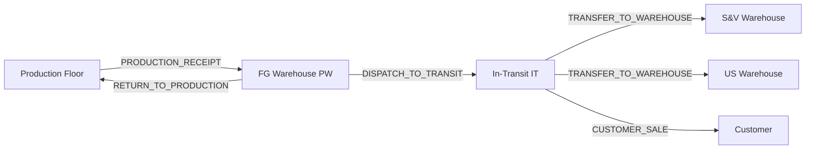
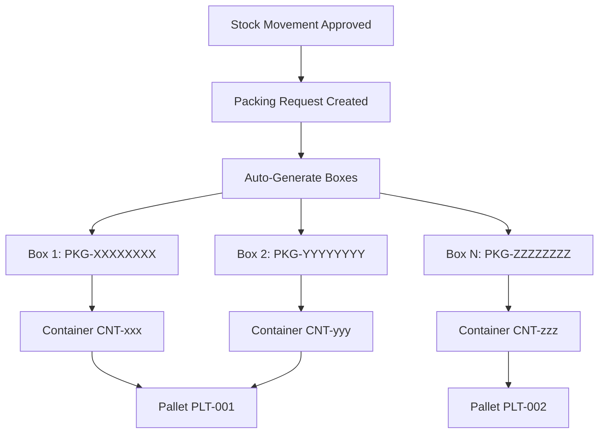
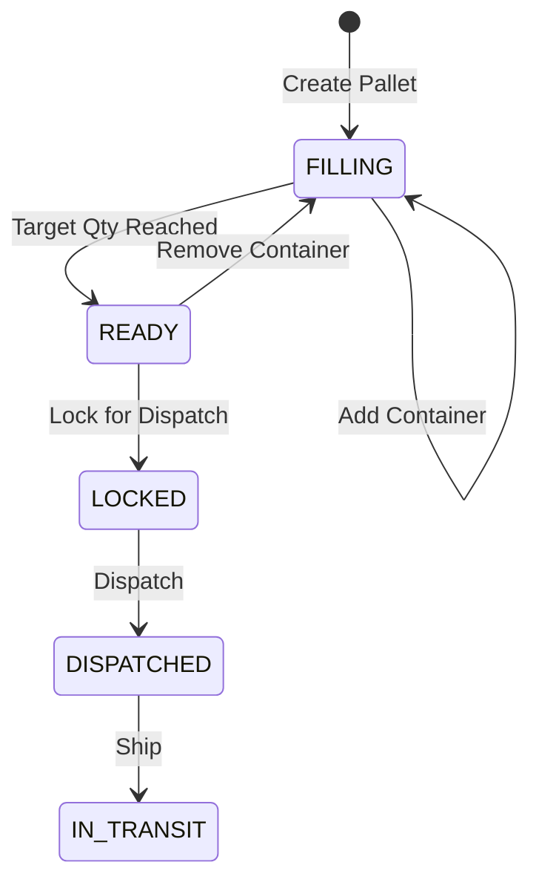
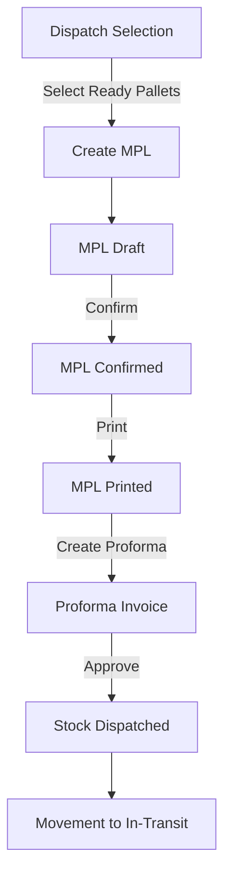

# Architecture Overview

> **Version:** 0.4.1 | **Last Updated:** 2026-03-06

## System Architecture

The WMS follows a **3-tier layered architecture** with clear separation of concerns:

```
┌────────────────────────────────────────────────────────────┐
│                   PRESENTATION LAYER                        │
│   React Components · Radix UI · Enterprise Design System   │
├────────────────────────────────────────────────────────────┤
│                    SERVICE LAYER                            │
│   packingService · packingEngineService · mplService       │
│   inventoryService · authService · permissionService       │
├────────────────────────────────────────────────────────────┤
│                   DATA ACCESS LAYER                         │
│   Supabase Client · PostgREST API · RLS Policies          │
├────────────────────────────────────────────────────────────┤
│                    DATABASE LAYER                            │
│   PostgreSQL 15 · Row Level Security · Stored Functions    │
└────────────────────────────────────────────────────────────┘
```

## Frontend Architecture

- **Framework:** React 18 with TypeScript
- **Build Tool:** Vite with SWC compiler
- **State Management:** React hooks + Supabase real-time subscriptions
- **Routing:** Client-side view switching in `App.tsx` (SPA)
- **UI Framework:** Radix UI primitives with custom enterprise design system
- **Charts:** Recharts for dashboard visualizations

## Backend Services

All backend logic runs on **Supabase**, which provides:

1. **PostgREST API** — Auto-generated REST API from PostgreSQL tables
2. **Auth** — Built-in authentication with JWT tokens
3. **RLS** — Row Level Security for data access control
4. **Edge Functions** — Serverless functions for complex operations

## Database Structure

See [DATABASE_SCHEMA.md](DATABASE_SCHEMA.md) for complete schema documentation.

Key table groups:

| Group | Tables | Purpose |
|-------|--------|---------|
| **Inventory** | `items`, `inventory`, `inv_warehouse_stock`, `inv_stock_ledger` | Core inventory data |
| **Movements** | `inv_movement_headers`, `inv_movement_lines` | Stock movement tracking |
| **Packing** | `packing_requests`, `packing_boxes`, `packing_audit_logs` | Packing workflow |
| **Engine** | `pack_containers`, `pallets`, `pallet_state_log` | Container/pallet management |
| **Dispatch** | `packing_lists`, `pack_invoices`, `proforma_invoices` | Dispatch and invoicing |
| **Auth** | `profiles`, `roles`, `permissions`, `user_permissions` | RBAC system |

## Warehouse Workflow

### Stock Movement Flow


```mermaid
flowchart LR
    A[Production Floor] -->|PRODUCTION_RECEIPT| B[FG Warehouse PW]
    B -->|DISPATCH_TO_TRANSIT| C[In-Transit IT]
    C -->|TRANSFER_TO_WAREHOUSE| D["S&V Warehouse"]
    C -->|TRANSFER_TO_WAREHOUSE| E[US Warehouse]
    B -->|RETURN_TO_PRODUCTION| A
    C -->|CUSTOMER_SALE| F[Customer]
```

### Packing Container Hierarchy


```mermaid
flowchart TD
    A[Stock Movement Approved] --> B[Packing Request Created]
    B --> C[Auto-Generate Boxes]
    C --> D["Box 1: PKG-XXXXXXXX"]
    C --> E["Box 2: PKG-YYYYYYYY"]
    C --> F["Box N: PKG-ZZZZZZZZ"]
    D --> G["Container CNT-xxx"]
    E --> H["Container CNT-yyy"]
    F --> I["Container CNT-zzz"]
    G --> J["Pallet PLT-001"]
    H --> J
    I --> K["Pallet PLT-002"]
```

### Pallet State Machine


```mermaid
stateDiagram-v2
    [*] --> FILLING: Create Pallet
    FILLING --> READY: Target Qty Reached
    FILLING --> FILLING: Add Container
    READY --> LOCKED: Lock for Dispatch
    LOCKED --> DISPATCHED: Dispatch
    DISPATCHED --> IN_TRANSIT: Ship
    READY --> FILLING: Remove Container
```

### Master Packing List Flow


```mermaid
flowchart TD
    A[Dispatch Selection] -->|Select Ready Pallets| B[Create MPL]
    B --> C[MPL Draft]
    C -->|Confirm| D[MPL Confirmed]
    D -->|Print| E[MPL Printed]
    E -->|Create Proforma| F[Proforma Invoice]
    F -->|Approve| G[Stock Dispatched]
    G --> H[Movement to In-Transit]
```

## Security Architecture

- **Authentication:** Supabase Auth with email/password
- **Authorization:** 3-tier RBAC (L1 Operator, L2 Supervisor, L3 Admin)
- **Granular RBAC:** Per-user permission overrides via `get_effective_permissions()`
- **Data Security:** PostgreSQL RLS on all tables

## Detailed Architecture

For in-depth documentation, see the architecture series:

1. [System Overview](architecture/01-SYSTEM-OVERVIEW.md)
2. [Layered Architecture](architecture/02-LAYERED-ARCHITECTURE.md)
3. [Frontend Architecture](architecture/03-FRONTEND-ARCHITECTURE.md)
4. [Authentication & RBAC](architecture/04-AUTHENTICATION-RBAC.md)
5. [Service Layer](architecture/05-SERVICE-LAYER.md)
6. [Backend Edge Functions](architecture/06-BACKEND-EDGE-FUNCTIONS.md)
7. [Database Architecture](architecture/07-DATABASE-ARCHITECTURE.md)
8. [Data Flow Diagrams](architecture/08-DATA-FLOW-DIAGRAMS.md)
9. [Module Breakdown](architecture/09-MODULE-BREAKDOWN.md)
10. [Security Architecture](architecture/10-SECURITY-ARCHITECTURE.md)
11. [Deployment Architecture](architecture/11-DEPLOYMENT-ARCHITECTURE.md)
12. [Directory Structure](architecture/12-DIRECTORY-STRUCTURE.md)

## Related Documentation

- [RBAC Database Reference](reference/rbac-database.md) — Full RBAC system details
- [Design System](reference/design-system.md) — UI design tokens and patterns
- [Troubleshooting](reference/troubleshooting.md) — Common issues and fixes
- [Stock Movement Workflow](workflows/stock-movement.md) — Stock movement details
