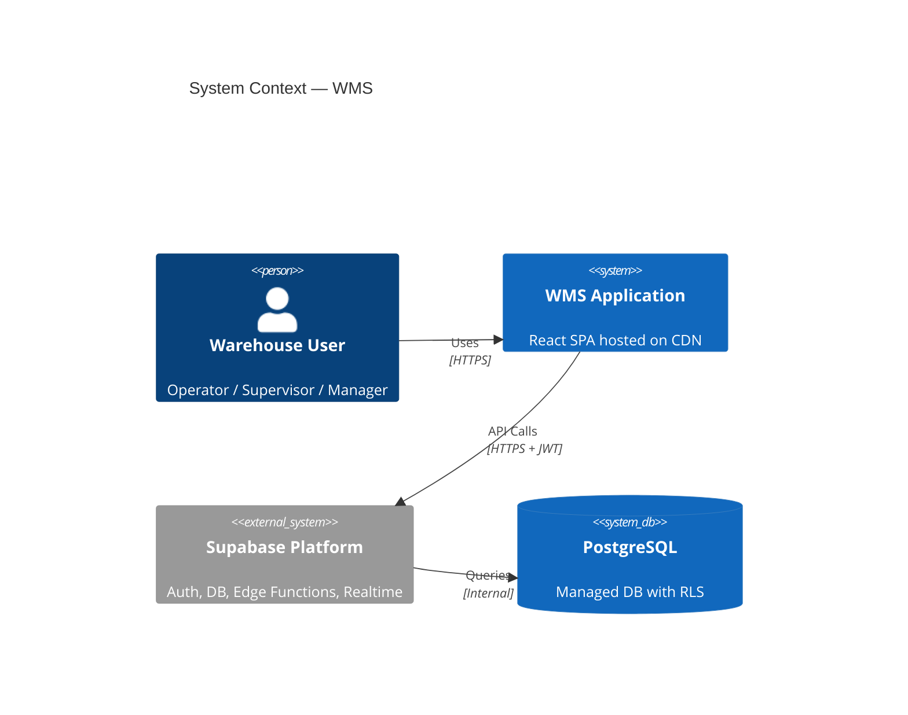

# 01 — System Overview

> **AutoCrat Engineers — Warehouse Management System (WMS)**

---

## 1.1 Purpose

The WMS is an **enterprise-grade, real-time inventory and supply chain management platform** designed for manufacturing environments. It provides end-to-end visibility across:

- **Finished Goods (FG) inventory** across multiple warehouse types
- **Blanket order management** and scheduled release tracking
- **Demand forecasting** using Holt-Winters triple exponential smoothing
- **Material Requirements Planning (MRP)** with actionable recommendations
- **Stock movement ledger** — an immutable audit trail for every IN/OUT transaction

---

## 1.2 Technology Stack

| Layer | Technology | Version | Purpose |
|-------|-----------|---------|---------|
| **Frontend Framework** | React | 18.3.x | Component-based UI |
| **Language** | TypeScript | 5.x | End-to-end type safety |
| **Build Tool** | Vite | 6.3.5 | Lightning-fast HMR & builds |
| **SWC Compiler** | @vitejs/plugin-react-swc | 3.10.x | Rust-powered JSX transform |
| **UI Primitives** | Radix UI | Various | Accessible, unstyled components |
| **Charting** | Recharts | 2.15.x | Data visualisation |
| **Icons** | Lucide React | 0.487.x | Feather-based icon set |
| **Forms** | React Hook Form | 7.55.x | Performant form management |
| **Toasts** | Sonner | 2.0.x | Non-intrusive notifications |
| **Backend-as-a-Service** | Supabase | Latest | Auth, DB, Edge Functions, Realtime |
| **Edge Functions Runtime** | Hono | Latest | Lightweight HTTP framework on Deno |
| **Database** | PostgreSQL | 15+ | Managed via Supabase |
| **Styling** | CSS + Tailwind Merge | — | Utility-first with merge support |

---

## 1.3 Design Principles

| Principle | Implementation |
|-----------|---------------|
| **Modularity** | Each functional domain (Items, Inventory, Orders, Forecasting, Planning) is self-contained with its own components, hooks, services, and types. |
| **Type Safety** | TypeScript interfaces span from the database schema through services to React components, ensuring compile-time correctness. |
| **Unidirectional Data Flow** | `Component → Hook → Service → Supabase Client → PostgreSQL` — never the reverse direction for mutations. |
| **Immutable Audit Trail** | Every stock change generates a `stock_movements` ledger entry. Direct `UPDATE` of inventory balances is disallowed without a corresponding movement record. |
| **Role-Based Access Control** | Three-tier RBAC (L1 Operator → L2 Supervisor → L3 Manager) enforced at both the application and database levels via Row Level Security. |
| **Real-time Sync** | Supabase Realtime subscriptions push database changes to all connected clients instantly. |
| **Zero Public Signup** | User accounts are created exclusively by L3 Managers through administered provisioning — no self-registration. |

---

## 1.4 System Context Diagram

---

## 1.5 Key Business Domains

| Domain | Tables | Primary Concern |
|--------|--------|-----------------|
| **Item Master** | `items` | Finished goods catalog — codes, pricing, lead times |
| **Inventory** | `inventory`, `stock_movements` | Real-time stock levels, movement ledger |
| **Blanket Orders** | `blanket_orders`, `blanket_order_items`, `blanket_order_lines`, `blanket_releases` | Customer scheduling agreements & release tracking |
| **Forecasting** | `demand_history`, `demand_forecasts` | Statistical demand prediction |
| **Planning (MRP)** | `planning_recommendations` | Replenishment actions & priorities |
| **Auth & RBAC** | `profiles`, `roles`, `permissions`, `user_roles`, `temp_credentials`, `audit_log`, `audit_logs` | Identity, access control, audit |

---

**Next**: [02-LAYERED-ARCHITECTURE.md](./02-LAYERED-ARCHITECTURE.md) →

---

© 2026 AutoCrat Engineers. All rights reserved.
