# 02 — Layered Architecture

> Full architectural layer decomposition of the WMS application.

---

## 2.1 Architecture Overview Diagram

```mermaid
graph TB
    subgraph PRESENTATION["🖥️ PRESENTATION LAYER — React 18 + TypeScript"]
        direction LR
        LP[LoginPage]
        DASH[DashboardNew]
        IM[ItemMasterSupabase]
        IG[InventoryGrid]
        SM[StockMovement]
        BO[BlanketOrders]
        BR[BlanketReleases]
        FM[ForecastingModule]
        PM[PlanningModule]
        UM[UserManagement]
        SDC[StockDistributionCard]
        EB[ErrorBoundary]
        LOAD[LoadingPage]
    end

    subgraph UI_LIB["🎨 UI COMPONENT LIBRARY — Radix + Custom"]
        direction LR
        BTN[Button]
        DLG[Dialog]
        TBL[Table]
        FRM[Form]
        SEL[Select]
        TAB[Tabs]
        CARD[Card]
        BADGE[Badge]
        TOAST[Sonner Toast]
        CHART[Recharts]
        ENT[EnterpriseUI]
        MORE["+40 more primitives"]
    end

    subgraph STATE["⚡ STATE & LOGIC LAYER"]
        direction LR
        AC[AuthContext<br/>RBAC Provider]
        HD[useDashboard]
        HI["useInventory<br/>(8 hooks)"]
        PR[ProtectedRoute]
    end

    subgraph SERVICE["🔧 SERVICE LAYER — Client-Side"]
        direction LR
        AS[authService]
        US[userService]
        IS[inventoryService]
        ISB[itemsSupabase]
        SV[services API]
        FWA[fetchWithAuth]
    end

    subgraph BACKEND["☁️ BACKEND — Supabase Edge Functions (Hono)"]
        direction TB
        subgraph SERVICES_BE["Services"]
            direction LR
            ITS[ItemService]
            INS[InventoryService]
            BOS[BlanketOrderService]
            BRS[BlanketReleaseService]
            FS[ForecastingService]
            PS[PlanningService]
        end
        subgraph REPOS["Repositories"]
            direction LR
            IR[ItemRepository]
            INR[InventoryRepository]
            BOR[BlanketOrderRepository]
        end
        SERVICES_BE --> REPOS
    end

    subgraph DATA["🗄️ DATA LAYER — PostgreSQL via Supabase"]
        direction LR
        T_ITEMS[(items)]
        T_INV[(inventory)]
        T_SM[(stock_movements)]
        T_BO[(blanket_orders)]
        T_BR[(blanket_releases)]
        T_DF[(demand_forecasts)]
        T_PR[(profiles)]
        T_ROLES[(roles)]
        T_AUDIT[(audit_logs)]
        RLS{{Row Level Security}}
        VIEWS{{DB Views & Triggers}}
    end

    subgraph CROSS["🛡️ CROSS-CUTTING"]
        direction TB
        JWT[JWT Authentication]
        RBAC[RBAC L1/L2/L3]
        AUDIT[Audit Logging]
        RT[Realtime Subscriptions]
    end

    PRESENTATION --> UI_LIB
    PRESENTATION --> STATE
    STATE --> SERVICE
    SERVICE --> BACKEND
    SERVICE -.->|Direct Queries| DATA
    BACKEND --> DATA
    CROSS -.- PRESENTATION
    CROSS -.- STATE
    CROSS -.- SERVICE
    CROSS -.- BACKEND
    CROSS -.- DATA

    style PRESENTATION fill:#0f172a,stroke:#06b6d4,color:#e2e8f0
    style UI_LIB fill:#1e1b4b,stroke:#818cf8,color:#e2e8f0
    style STATE fill:#1a1a2e,stroke:#7c3aed,color:#e2e8f0
    style SERVICE fill:#052e16,stroke:#10b981,color:#e2e8f0
    style BACKEND fill:#451a03,stroke:#f59e0b,color:#e2e8f0
    style DATA fill:#450a0a,stroke:#ef4444,color:#e2e8f0
    style CROSS fill:#422006,stroke:#eab308,color:#e2e8f0
```

---

## 2.2 Layer Responsibilities

### Layer 1 — Presentation (React Components)

| Responsibility | Details |
|----------------|---------|
| **Rendering** | Display data using React functional components |
| **User Input** | Capture forms, filters, searches, clicks |
| **Navigation** | Single-page routing via state (`currentView`) |
| **Error Display** | `ErrorBoundary` wraps the entire app tree |
| **Loading States** | `LoadingPage` provides branded loading experience |

**Key Files**: `App.tsx`, `src/components/*.tsx`

---

### Layer 2 — State & Logic (Hooks + Context)

| Responsibility | Details |
|----------------|---------|
| **Auth State** | `AuthContext` manages session, role, login/logout |
| **Data Fetching** | Custom hooks (`useDashboard`, `useInventory`) encapsulate fetch + cache logic |
| **Route Protection** | `ProtectedRoute` guards views by minimum role |
| **Business Logic** | Stock calculations, alert generation, status derivation |

**Key Files**: `src/auth/context/AuthContext.tsx`, `src/hooks/*.ts`

---

### Layer 3 — Service Layer (Client-Side)

| Responsibility | Details |
|----------------|---------|
| **API Abstraction** | Services hide Supabase SDK details from components |
| **Auth API** | `authService.ts` — sign-in, sign-out, token management |
| **User API** | `userService.ts` — CRUD for user accounts (L3 only) |
| **Inventory API** | `inventoryService.ts` — dashboard, distribution, warehouse ops |
| **Items API** | `itemsSupabase.ts` — item CRUD, cascading deletes |
| **Token Injection** | `fetchWithAuth.ts` — wraps `fetch()` with JWT headers |

**Key Files**: `src/auth/services/*.ts`, `src/services/*.ts`, `src/utils/api/*.ts`

---

### Layer 4 — Backend (Supabase Edge Functions)

| Responsibility | Details |
|----------------|---------|
| **HTTP Routing** | Hono framework routes requests to service handlers |
| **Business Logic** | 6 services: Items, Inventory, BlanketOrders, BlanketReleases, Forecasting, Planning |
| **Data Access** | Repository pattern isolates raw SQL/Supabase queries |
| **Validation** | Input validation before database writes |

**Key Files**: `src/supabase/functions/server/index.tsx`, `server/services/*.ts`, `server/repositories/*.ts`

---

### Layer 5 — Data Layer (PostgreSQL)

| Responsibility | Details |
|----------------|---------|
| **Storage** | 15+ tables across 6 business domains |
| **Integrity** | Foreign keys, check constraints, unique constraints |
| **Security** | Row Level Security policies per role |
| **Computed Data** | Database views for dashboards and reports |
| **Audit Trail** | Triggers log mutations to `audit_logs` |

**Key Files**: `.db_reference/presentschema.sql`, `.db_reference/rbac.sql`

---

### Cross-Cutting Concerns

| Concern | Implementation |
|---------|---------------|
| **JWT Authentication** | Supabase Auth issues JWTs; client stores in memory; every request includes `Authorization: Bearer <token>` |
| **RBAC** | L1/L2/L3 role hierarchy checked at component render, hook fetch, and DB RLS levels |
| **Audit Logging** | `audit_log` + `audit_logs` tables record user actions with old/new values |
| **Realtime** | Supabase Realtime channels push `INSERT`/`UPDATE`/`DELETE` events to subscribed clients |

---

**← Previous**: [01-SYSTEM-OVERVIEW.md](./01-SYSTEM-OVERVIEW.md) | **Next**: [03-FRONTEND-ARCHITECTURE.md](./03-FRONTEND-ARCHITECTURE.md) →

---

© 2026 AutoCrat Engineers. All rights reserved.
