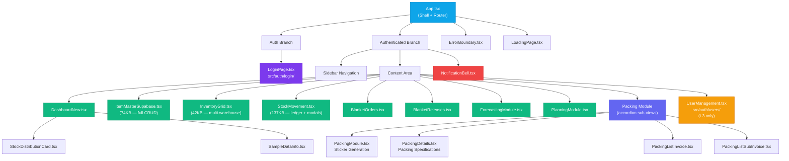

# 03 — Frontend Architecture

> React component hierarchy, routing, state management, and UI component library.

---

## 3.1 Application Shell

The application is a **single-page application (SPA)** built with React 18 and TypeScript. The entry point hierarchy is:

```
index.html
  └── main.tsx              (React root mount)
        └── App.tsx          (Application shell — auth, navigation, views)
```

`App.tsx` (~900 lines) acts as the **application shell** and owns:
- Authentication state (session, user, role)
- Navigation state (`currentView`)
- Menu rendering based on user role
- View routing via `renderContent()`

---

## 3.2 Component Tree



---

## 3.3 View Routing

Navigation is state-driven rather than URL-driven. The `currentView` state variable controls which component renders:

| View ID | Component | File | Description |
|---------|-----------|------|-------------|
| `dashboard` | `DashboardNew` | `components/DashboardNew.tsx` | KPIs, alerts, recent activity |
| `items` | `ItemMasterSupabase` | `components/ItemMasterSupabase.tsx` | Finished goods catalog CRUD |
| `inventory` | `InventoryGrid` | `components/InventoryGrid.tsx` | Multi-warehouse stock view |
| `stock-movements` | `StockMovement` | `components/StockMovement.tsx` | Movement ledger & transactions |
| `packing` / `packing-sticker` | `PackingModule` | `components/packing/PackingModule.tsx` | FG packing workflow & sticker generation |
| `packing-details` | `PackingDetails` | `components/packing/PackingDetails.tsx` | Packing specifications manager |
| `packing-list-invoice` | `PackingListInvoice` | `components/packing/PackingListInvoice.tsx` | Packing list against invoice |
| `packing-list-sub-invoice` | `PackingListSubInvoice` | `components/packing/PackingListSubInvoice.tsx` | Packing list against sub-invoice |
| `orders` | `BlanketOrders` | `components/BlanketOrders.tsx` | Customer scheduling agreements |
| `releases` | `BlanketReleases` | `components/BlanketReleases.tsx` | Release tracking & delivery |
| `forecast` | `ForecastingModule` | `components/ForecastingModule.tsx` | Demand prediction engine |
| `planning` | `PlanningModule` | `components/PlanningModule.tsx` | MRP recommendations |
| `users` | `UserManagement` | `auth/users/UserManagement.tsx` | User provisioning (L3 only) |

### Role-Based Menu Filtering

```typescript
// Menu items are filtered dynamically based on user role
const getMenuItems = () => {
    const items = [...menuItems]; // base items available to all roles
    
    // L2+ get Stock Movement access
    if (hasMinimumRole(userRole, 'L2')) {
        items.push({ id: 'stock-movement', ... });
    }
    
    // L3 only get User Management
    if (userRole === 'L3') {
        items.push({ id: 'users', ... });
    }
    
    return items;
};
```

---

## 3.4 UI Component Library

The application uses **51 UI primitives** built on Radix UI, located at `src/components/ui/`:

### Core Primitives

| Component | File | Built On |
|-----------|------|----------|
| `Button` | `button.tsx` | Radix Slot + CVA |
| `Dialog` / `Sheet` | `dialog.tsx`, `sheet.tsx` | Radix Dialog |
| `Table` | `table.tsx` | Native HTML + styles |
| `Select` | `select.tsx` | Radix Select |
| `Tabs` | `tabs.tsx` | Radix Tabs |
| `Card` | `card.tsx` | Native div + styles |
| `Badge` | `badge.tsx` | CVA variants |
| `Form` | `form.tsx` | React Hook Form + Radix Label |
| `Input` / `Textarea` | `input.tsx`, `textarea.tsx` | Native + styles |
| `Checkbox` / `Switch` | `checkbox.tsx`, `switch.tsx` | Radix primitives |
| `Tooltip` / `Popover` | `tooltip.tsx`, `popover.tsx` | Radix floating |
| `Alert Dialog` | `alert-dialog.tsx` | Radix AlertDialog |
| `Dropdown Menu` | `dropdown-menu.tsx` | Radix DropdownMenu |
| `Sidebar` | `sidebar.tsx` | Custom compound component |
| `Chart` | `chart.tsx` | Recharts wrapper |
| `Sonner` | `sonner.tsx` | Toast notifications |

### Custom Components

| Component | File | Purpose |
|-----------|------|---------|
| `EnterpriseUI` | `EnterpriseUI.tsx` | Branded enterprise layout shell |
| `SharedComponents` | `SharedComponents.tsx` | Shared reusable components across modules |
| `RotatingQuote` | `RotatingQuote.tsx` | Animated motivational quotes on login |
| `use-mobile` | `use-mobile.ts` | Responsive breakpoint detection hook |
| `utils` | `utils.ts` | `cn()` — Tailwind class merge utility |

---

## 3.5 Styling Strategy

| Concern | Approach |
|---------|----------|
| **Base Styles** | `src/index.css` (43KB) — comprehensive design system |
| **Global Overrides** | `src/styles/globals.css` |
| **Component Styles** | Tailwind-merge (`cn()` utility) for dynamic class composition |
| **Design Tokens** | CSS custom properties for colours, spacing, typography |
| **Dark Mode** | Supported via `next-themes` provider |
| **Responsive** | Mobile-first with `useMobile()` hook |

---

## 3.6 State Management

The application uses **React's built-in state** rather than external state managers:

| State Type | Mechanism | Scope |
|-----------|-----------|-------|
| **Auth State** | `AuthContext` (React Context) | Global |
| **View/Nav State** | `useState` in `App.tsx` | App-level |
| **Data State** | Custom hooks (`useDashboard`, `useInventory`) | Per-component |
| **Form State** | React Hook Form | Per-form |
| **UI State** | `useState` in components | Local |

---

**← Previous**: [02-LAYERED-ARCHITECTURE.md](./02-LAYERED-ARCHITECTURE.md) | **Next**: [04-AUTHENTICATION-RBAC.md](./04-AUTHENTICATION-RBAC.md) →

---

© 2026 AutoCrat Engineers. All rights reserved.
