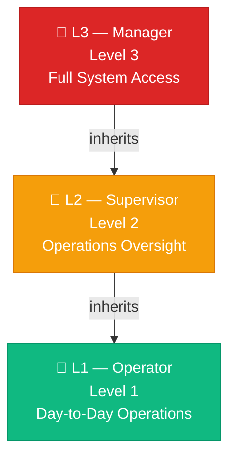
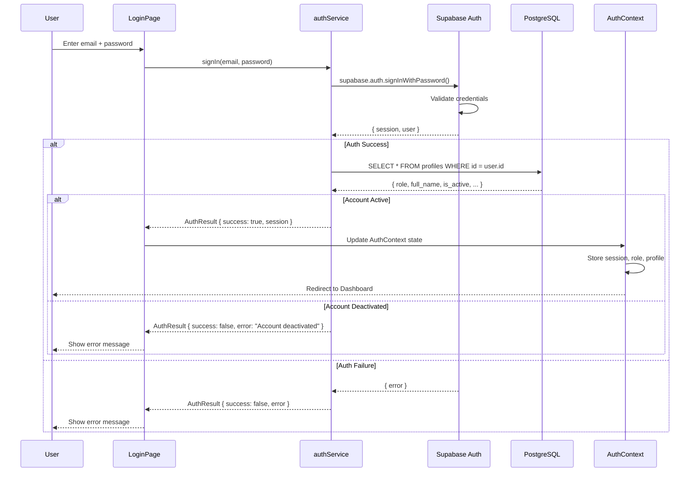
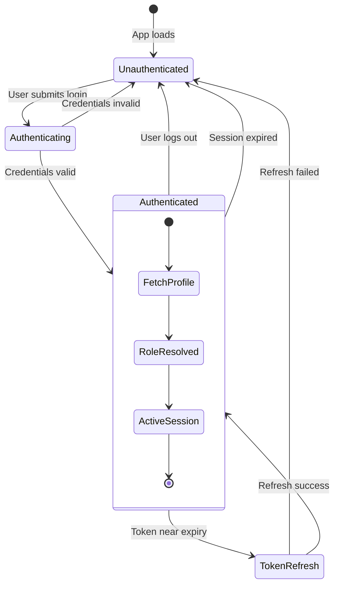
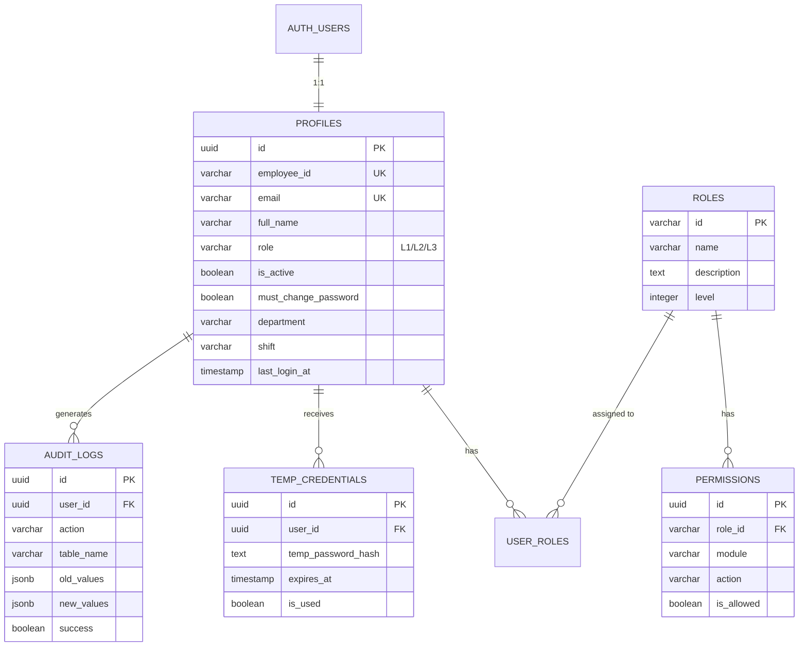

# 04 — Authentication & RBAC Architecture

> Enterprise Role-Based Access Control — the complete authentication lifecycle.

---

## 4.1 Authentication Model

The WMS uses a **zero-public-signup, manager-provisioned** authentication model:

- ❌ No self-registration
- ❌ No public sign-up endpoint
- ✅ Only L3 (Manager) users can create new accounts
- ✅ JWT-based session management via Supabase Auth

---

## 4.2 Role Hierarchy



### Role Configuration

```typescript
export const ROLE_CONFIG = {
    L3: {
        name: 'Manager',
        level: 3,
        description: 'Full access including user management',
        badge: 'Manager'
    },
    L2: {
        name: 'Supervisor',
        level: 2,
        description: 'Operations oversight and approval',
        badge: 'Supervisor'
    },
    L1: {
        name: 'Operator',
        level: 1,
        description: 'Day-to-day warehouse operations',
        badge: 'Operator'
    }
};
```

---

## 4.3 Permission Matrix

| Module | L1 (Operator) | L2 (Supervisor) | L3 (Manager) |
|--------|:---:|:---:|:---:|
| **Dashboard** | ✅ View | ✅ View | ✅ View |
| **Item Master** | ✅ View | ✅ View + Edit | ✅ Full CRUD |
| **Inventory Grid** | ✅ View | ✅ View | ✅ View |
| **Stock Movement** | ❌ | ✅ View + Create | ✅ Full Access |
| **Blanket Orders** | ✅ View | ✅ View + Edit | ✅ Full CRUD |
| **Blanket Releases** | ✅ View | ✅ View + Edit | ✅ Full CRUD |
| **Forecasting** | ✅ View | ✅ View + Run | ✅ Full Access |
| **MRP Planning** | ✅ View | ✅ View + Run | ✅ Full Access |
| **User Management** | ❌ | ❌ | ✅ Full CRUD |

---

## 4.4 Authentication Flow



---

## 4.5 Session Lifecycle



### Token Management

| Aspect | Implementation |
|--------|---------------|
| **Token Storage** | In-memory (React state) — not localStorage |
| **Token Refresh** | `refreshToken()` via Supabase SDK |
| **Token Injection** | Every API call includes `Authorization: Bearer <token>` |
| **Session Check** | `getCurrentSession()` on app mount |
| **Auth Listener** | `onAuthStateChange()` subscription for session events |

---

## 4.6 Auth Module File Structure

```
src/auth/
├── index.ts                    ← Barrel exports (centralised API)
├── context/
│   └── AuthContext.tsx          ← React Context provider + useAuth hook
├── services/
│   ├── authService.ts           ← Sign-in, sign-out, token, permissions
│   └── userService.ts           ← User CRUD, role updates (L3 only)
├── components/
│   ├── ProtectedRoute.tsx       ← HOC + hook for role-based route guarding
│   └── RoleBadge.tsx            ← Visual role indicator component
├── login/
│   └── LoginPage.tsx            ← Enterprise login UI with branding
└── users/
    └── UserManagement.tsx       ← Admin panel for user provisioning
```

---

## 4.7 Database Auth Tables



---

## 4.8 Security Functions

| Function | Source | Purpose |
|----------|--------|---------|
| `signIn()` | `authService.ts` | Authenticate user, fetch profile, build session |
| `signOut()` | `authService.ts` | Invalidate session, clear state |
| `getCurrentSession()` | `authService.ts` | Reconstruct session from Supabase SDK |
| `getAccessToken()` | `authService.ts` | Extract current JWT |
| `refreshToken()` | `authService.ts` | Refresh expired JWT |
| `getUserPermissions()` | `authService.ts` | Query permissions table for current user |
| `hasPermission()` | `authService.ts` | Check module + action permission |
| `hasMinimumRole()` | `authService.ts` | Compare role levels (L1 < L2 < L3) |
| `logAuditEvent()` | `authService.ts` | Write to audit_log table |
| `onAuthStateChange()` | `authService.ts` | Subscribe to session events |

---

**← Previous**: [03-FRONTEND-ARCHITECTURE.md](./03-FRONTEND-ARCHITECTURE.md) | **Next**: [05-SERVICE-LAYER.md](./05-SERVICE-LAYER.md) →

---

© 2026 AutoCrat Engineers. All rights reserved.
