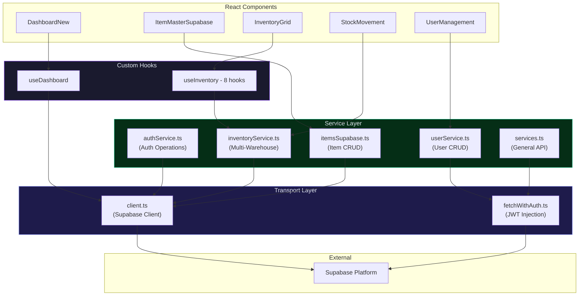

# 05 — Service Layer Architecture

> Client-side services, API abstraction, and Supabase integration.

---

## 5.1 Service Layer Diagram



---

## 5.2 Service File Map

### `src/auth/services/authService.ts` — Authentication Service

| Function | Signature | Purpose |
|----------|-----------|---------|
| `signIn` | `(email, password) → AuthResult` | Authenticate + build session |
| `signOut` | `() → { success, error? }` | End session |
| `getCurrentSession` | `() → AuthSession | null` | Get active session |
| `getAccessToken` | `() → string | null` | Extract JWT |
| `refreshToken` | `() → string | null` | Refresh expired JWT |
| `getUserPermissions` | `() → Permission[]` | Fetch permissions |
| `hasPermission` | `(module, action) → boolean` | Permission check |
| `hasMinimumRole` | `(userRole, requiredRole) → boolean` | Role level comparison |
| `logAuditEvent` | `(userId, action, ...) → void` | Write audit log |
| `onAuthStateChange` | `(callback) → unsubscribe` | Listen for auth changes |

---

### `src/auth/services/userService.ts` — User Management Service

| Function | Signature | Purpose |
|----------|-----------|---------|
| `getAllUsers` | `() → UserListItem[]` | List all user profiles |
| `getUserById` | `(id) → UserListItem` | Get single user |
| `createUser` | `(CreateUserRequest) → result` | Provision new user (L3 only) |
| `updateUser` | `(id, UpdateUserRequest) → result` | Update user details |
| `updateUserRole` | `(id, role) → result` | Change user role |
| `updateUserStatus` | `(id, isActive) → result` | Activate / deactivate |
| `deleteUser` | `(id) → result` | Soft delete user |
| `getAuditLog` | `(filters?) → AuditEntry[]` | Fetch audit trail |

---

### `src/services/inventoryService.ts` — Multi-Warehouse Inventory Service

| Function | Signature | Maps To |
|----------|-----------|---------|
| `getItemStockDashboard` | `(itemCode) → ItemStockDashboard` | `vw_item_stock_dashboard` |
| `getAllItemsStockDashboard` | `(filters?) → ItemStockDashboard[]` | `vw_item_stock_dashboard` |
| `getItemStockDistribution` | `(itemCode) → ItemStockDistribution` | `vw_item_stock_distribution` |
| `getAllItemsStockDistribution` | `() → ItemStockDistribution[]` | `vw_item_stock_distribution` |
| `getItemWarehouseDetails` | `(itemCode) → ItemWarehouseDetail[]` | `vw_item_warehouse_detail` |
| `getWarehouseStockDetails` | `(warehouseCode) → ItemWarehouseDetail[]` | `vw_item_warehouse_detail` |
| `getItemStockSummary` | `(filters?) → ItemStockSummary[]` | `vw_item_stock_summary` |
| `getBlanketReleaseReservations` | `(itemCode?) → BlanketReleaseReservation[]` | `vw_blanket_release_reservations` |
| `getNextMonthReservedQty` | `(itemCode) → number` | Computed from reservations |
| `getRecentStockMovements` | `(filters?) → RecentStockMovement[]` | `vw_recent_stock_movements` |
| `getWarehouseTypes` | `() → WarehouseType[]` | `warehouse_types` |
| `getWarehouses` | `(category?) → Warehouse[]` | `warehouses` |
| `getWarehouseByCode` | `(code) → Warehouse` | `warehouses` |
| `validateStockForRelease` | `(warehouseId, itemCode, qty) → boolean` | Validation logic |
| `executeBlanketRelease` | `(releaseId, warehouseId, ...) → string` | RPC call |
| `getWarehouseStock` | `(warehouseId, itemCode) → WarehouseStock` | `warehouse_stock` |

---

### `src/utils/api/itemsSupabase.ts` — Item Master API

| Function | Signature | Purpose |
|----------|-----------|---------|
| Item CRUD | `fetchItems`, `createItem`, `updateItem`, `deleteItem` | Full item lifecycle |
| Cascading Delete | Hard delete with associated inventory, movements, forecasts | Data cleanup |

---

### `src/utils/api/client.ts` — Supabase Client Factory

```typescript
// Singleton Supabase client initialisation
export function getSupabaseClient() {
    // Returns configured SupabaseClient instance
    // with environment variables for URL and anon key
}
```

---

### `src/utils/api/fetchWithAuth.ts` — Authenticated Fetch Wrapper

Wraps the native `fetch()` to automatically:
1. Attach `Authorization: Bearer <JWT>` header
2. Handle 401 responses by refreshing token and retrying once
3. Parse error responses consistently

---

## 5.3 Data Access Patterns

### Pattern 1: Direct Supabase Query (Hooks / Services)

```
Component → Hook → supabase.from('table').select() → PostgreSQL
```

Used by: `useDashboard`, `useInventory` hooks, `inventoryService`

### Pattern 2: Edge Function via fetchWithAuth

```
Component → Service → fetchWithAuth(edgeFunctionUrl) → Hono Router → Repository → PostgreSQL
```

Used by: Complex business operations with multi-step transactions

### Pattern 3: RPC Call

```
Service → supabase.rpc('function_name', params) → PostgreSQL Function
```

Used by: `executeBlanketRelease`, complex aggregations

---

## 5.4 Helper Utilities

| Utility | File | Purpose |
|---------|------|---------|
| `toCamelCase()` | `inventoryService.ts` | Convert `snake_case` DB columns to `camelCase` JS objects |
| `cn()` | `ui/utils.ts` | Tailwind class merge utility |
| `useMobile()` | `ui/use-mobile.ts` | Responsive breakpoint detection |

---

**← Previous**: [04-AUTHENTICATION-RBAC.md](./04-AUTHENTICATION-RBAC.md) | **Next**: [06-BACKEND-EDGE-FUNCTIONS.md](./06-BACKEND-EDGE-FUNCTIONS.md) →

---

© 2026 AutoCrat Engineers. All rights reserved.
