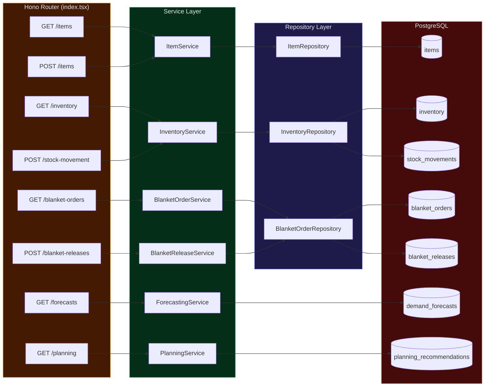

# 06 — Backend — Edge Functions Architecture

> Supabase Edge Functions with Hono framework, service layer, and repository pattern.

---

## 6.1 Overview

The backend runs as **Supabase Edge Functions** — serverless Deno functions deployed to Supabase's infrastructure. The entry point uses the **Hono** framework for HTTP routing.

```
src/supabase/functions/server/
├── index.tsx                  ← Hono HTTP router (86KB — main entry point)
├── services/
│   ├── ItemService.ts         ← Item business logic
│   ├── InventoryService.ts    ← Inventory operations
│   ├── BlanketOrderService.ts ← Blanket order management
│   ├── BlanketReleaseService.ts ← Release processing
│   ├── ForecastingService.ts  ← Holt-Winters forecasting
│   └── PlanningService.ts     ← MRP recommendations
└── repositories/
    ├── ItemRepository.ts      ← Item data access
    ├── InventoryRepository.ts ← Inventory data access
    └── BlanketOrderRepository.ts ← Order data access
```

---

## 6.2 Architecture Pattern

The backend follows a strict **Service → Repository** pattern:



---

## 6.3 Backend Services

### ItemService (`services/ItemService.ts`)

| Method | Purpose |
|--------|---------|
| `getAll()` | List all items with optional filters |
| `getByCode(code)` | Get single item by item_code |
| `create(data)` | Create new item with validation |
| `update(code, data)` | Update item fields |
| `delete(code)` | Delete item (cascade check) |

### InventoryService (`services/InventoryService.ts`)

| Method | Purpose |
|--------|---------|
| `getStock(itemCode)` | Current stock levels |
| `recordMovement(movement)` | Record IN/OUT with balance update |
| `getMovementHistory(filters)` | Query stock_movements table |
| `adjustStock(itemCode, qty, reason)` | Manual stock adjustment |

### BlanketOrderService (`services/BlanketOrderService.ts`)

| Method | Purpose |
|--------|---------|
| `getAll()` | List active blanket orders |
| `create(order)` | Create new scheduling agreement |
| `addLineItems(orderId, items)` | Add items to order |
| `updateStatus(orderId, status)` | Status transitions |

### BlanketReleaseService (`services/BlanketReleaseService.ts`)

| Method | Purpose |
|--------|---------|
| `getReleasesForOrder(orderId)` | List releases for an order |
| `createRelease(release)` | Create delivery release |
| `processDelivery(releaseId, qty)` | Record actual delivery |
| `updateTracking(releaseId, info)` | Add shipment/tracking |

### ForecastingService (`services/ForecastingService.ts`)

| Method | Purpose |
|--------|---------|
| `generateForecast(itemCode, params)` | Run Holt-Winters algorithm |
| `getForecasts(itemCode)` | Retrieve stored forecasts |
| `getAccuracy(itemCode)` | Compare forecasted vs actual |
| `updateParams(alpha, beta, gamma)` | Tune smoothing parameters |

**Algorithm**: Holt-Winters Triple Exponential Smoothing
- α (alpha) — Level smoothing
- β (beta) — Trend smoothing
- γ (gamma) — Seasonal smoothing

### PlanningService (`services/PlanningService.ts`)

| Method | Purpose |
|--------|---------|
| `generateRecommendations()` | Run MRP for all items |
| `getRecommendations(filters)` | Fetch planning actions |
| `updateStatus(id, status)` | Approve/reject recommendations |
| `calculateNetRequirements(item)` | Current stock - reserved - forecasted demand |

---

## 6.4 Repository Pattern

Repositories provide a **clean data access abstraction** between services and the database:

```typescript
// Example: ItemRepository
class ItemRepository {
    async findAll(filters?: ItemFilters): Promise<Item[]> {
        const { data } = await supabase
            .from('items')
            .select('*')
            .match(filters);
        return data;
    }

    async findByCode(code: string): Promise<Item | null> {
        const { data } = await supabase
            .from('items')
            .select('*')
            .eq('item_code', code)
            .single();
        return data;
    }

    async create(item: CreateItemDTO): Promise<Item> { ... }
    async update(code: string, data: UpdateItemDTO): Promise<Item> { ... }
    async delete(code: string): Promise<void> { ... }
}
```

### Repository Files

| Repository | File | Tables Accessed |
|-----------|------|-----------------|
| `ItemRepository` | `repositories/ItemRepository.ts` | `items` |
| `InventoryRepository` | `repositories/InventoryRepository.ts` | `inventory`, `stock_movements` |
| `BlanketOrderRepository` | `repositories/BlanketOrderRepository.ts` | `blanket_orders`, `blanket_order_lines`, `blanket_releases` |

---

## 6.5 Deployment

Edge Functions are deployed via the Supabase CLI:

```bash
# Deploy a single function
supabase functions deploy server

# Deploy with JWT verification
supabase functions deploy server --verify-jwt
```

---

**← Previous**: [05-SERVICE-LAYER.md](./05-SERVICE-LAYER.md) | **Next**: [07-DATABASE-ARCHITECTURE.md](./07-DATABASE-ARCHITECTURE.md) →

---

© 2026 AutoCrat Engineers. All rights reserved.
