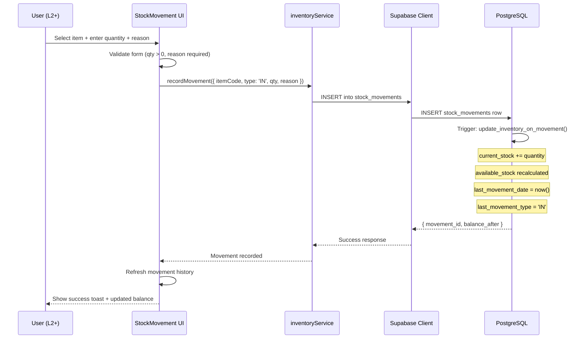
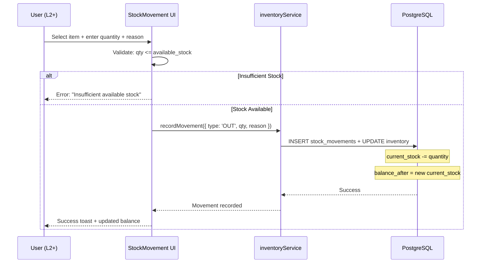
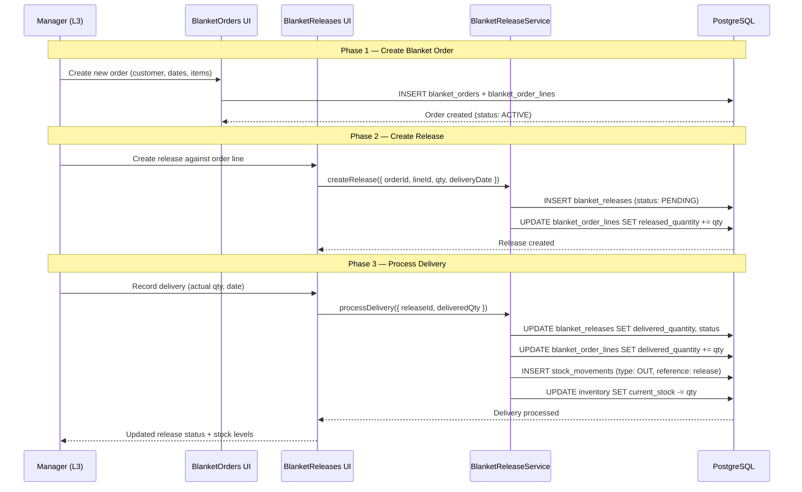
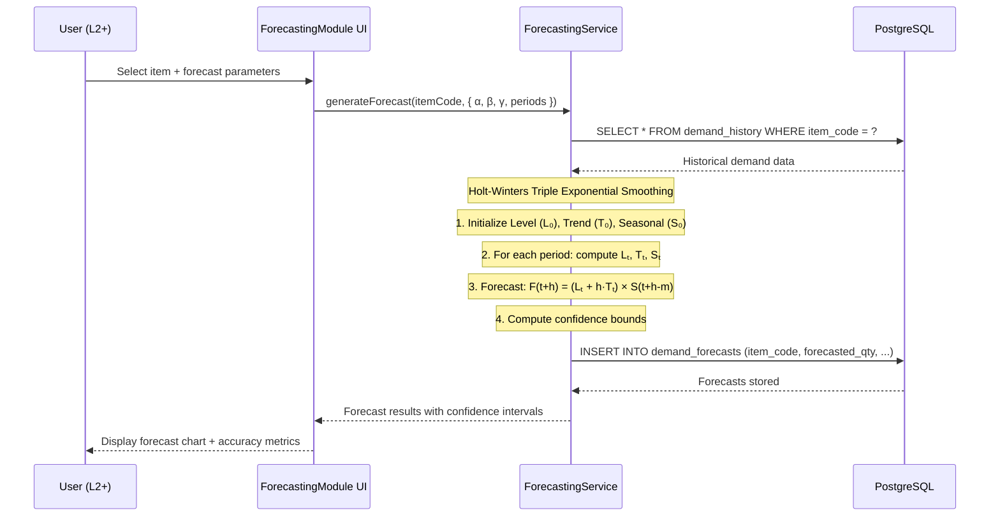
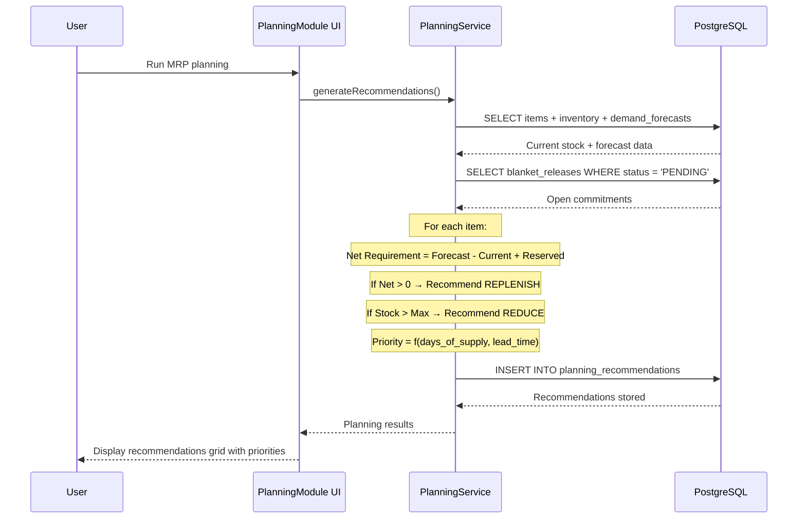
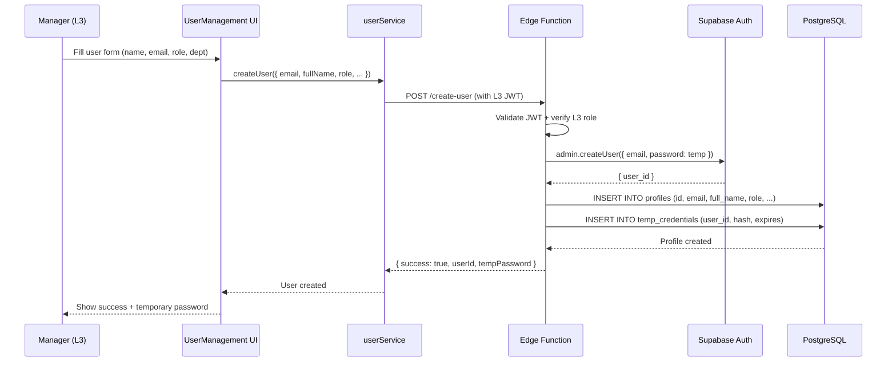
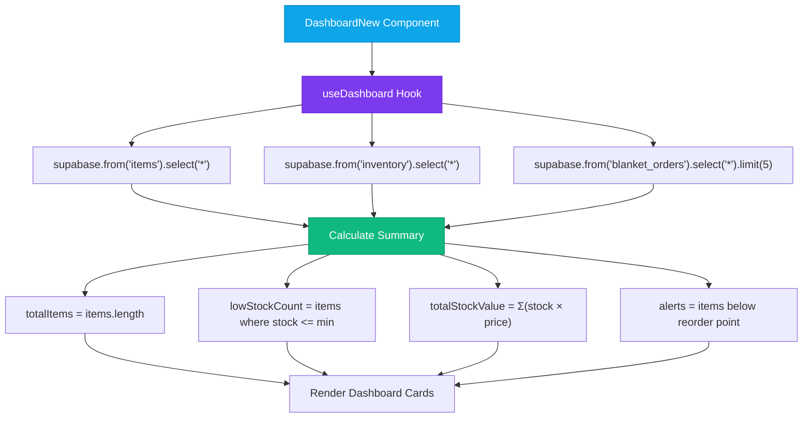

# 08 — Data Flow Diagrams

> End-to-end data flows for every major operation in the WMS.

---

## 8.1 Stock Inward (IN) Flow

---

## 8.2 Stock Outward (OUT) Flow

---

## 8.3 Blanket Order → Release → Delivery Flow

---

## 8.4 Demand Forecasting Flow

---

## 8.5 MRP Planning Flow

---

## 8.6 User Provisioning Flow (L3 Only)

---

## 8.7 Dashboard Data Aggregation Flow

---

**← Previous**: [07-DATABASE-ARCHITECTURE.md](./07-DATABASE-ARCHITECTURE.md) | **Next**: [09-MODULE-BREAKDOWN.md](./09-MODULE-BREAKDOWN.md) →

---

© 2026 AutoCrat Engineers. All rights reserved.
