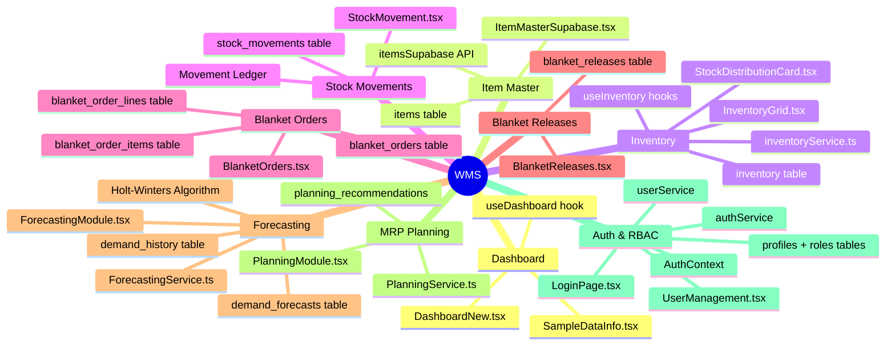

# 09 — Module Breakdown

> Deep dive into each functional module: responsibilities, files, database tables, and hooks.

---

## 9.1 Module Map



---

## 9.2 Module: Dashboard

| Aspect | Detail |
|--------|--------|
| **Component** | `DashboardNew.tsx` (16KB) |
| **Hook** | `useDashboard.ts` |
| **Purpose** | Real-time KPI overview, stock alerts, recent activity |
| **Data Sources** | `items`, `inventory`, `blanket_orders` tables |

### KPIs Displayed
- Total active items count
- Low stock / critical alert count
- Healthy stock count
- Total inventory value (Σ stock × unit_price)
- Recent blanket orders (last 5)
- Stock alerts sorted by severity (critical → warning)

### Sub-Components
| Component | Purpose |
|-----------|---------|
| `StockDistributionCard.tsx` | Visual stock breakdown by warehouse type |
| `SampleDataInfo.tsx` | Info banner when running with sample data |

---

## 9.3 Module: Item Master

| Aspect | Detail |
|--------|--------|
| **Component** | `ItemMasterSupabase.tsx` (80KB) |
| **API** | `src/utils/api/itemsSupabase.ts` |
| **Purpose** | Full CRUD for finished goods catalog |
| **Tables** | `items` |

### Operations
| Operation | Method | Notes |
|-----------|--------|-------|
| **List** | `SELECT * FROM items` | With search, filter, sort |
| **Create** | `INSERT INTO items` | Validates unique item_code |
| **Update** | `UPDATE items SET ...` | Tracks updated_at |
| **Delete** | Cascading hard delete | Removes item + inventory + movements + forecasts |

### Key Fields
- `item_code` — Unique identifier (e.g., "FG-001")
- `item_name` — Display name
- `uom` — Unit of Measure (default: PCS)
- `unit_price` / `standard_cost` — Pricing
- `lead_time_days` — Procurement/production lead time
- `master_serial_no`, `part_number`, `revision` — Engineering attributes

---

## 9.4 Module: Inventory (Multi-Warehouse)

| Aspect | Detail |
|--------|--------|
| **Component** | `InventoryGrid.tsx` (51KB) |
| **Service** | `inventoryService.ts` (16KB) |
| **Hooks** | 8 hooks in `useInventory.ts` (17KB) |
| **Purpose** | Multi-warehouse stock visibility and management |
| **Tables** | `inventory`, `warehouse_stock`, `warehouses`, `warehouse_types` |

### Hooks Available

| Hook | Purpose |
|------|---------|
| `useItemStockDashboard` | Single item stock KPIs |
| `useAllItemsStockDashboard` | All items stock overview |
| `useItemStockDistribution` | Stock breakdown by category |
| `useItemWarehouseDetails` | Per-warehouse drill-down |
| `useItemStockSummary` | Summary grid data |
| `useBlanketReleaseReservations` | Reserved stock against orders |
| `useRecentStockMovements` | Movement history |
| `useWarehouses` | Warehouse master data |

### Stock Attributes
| Attribute | Formula |
|-----------|---------|
| **On-Hand (Current)** | Physical stock count |
| **Allocated** | Reserved for production orders |
| **Reserved** | Held for blanket releases |
| **In Transit** | Between warehouses |
| **Available** | `current - allocated - reserved` |

---

## 9.5 Module: Stock Movements

| Aspect | Detail |
|--------|--------|
| **Component** | `StockMovement.tsx` (132KB — largest component) |
| **Purpose** | Immutable transaction ledger for all stock changes |
| **Tables** | `stock_movements`, `inventory` |

### Movement Types
| Type | Direction | Examples |
|------|-----------|----------|
| `IN` | Stock increase | Production receipt, purchase receipt, return |
| `OUT` | Stock decrease | Customer dispatch, blanket release, scrap |

### Transaction Types
| Transaction | Description |
|-------------|-------------|
| `PRODUCTION_RECEIPT` | Goods from production line |
| `PURCHASE_RECEIPT` | Goods from supplier |
| `CUSTOMER_DISPATCH` | Outbound to customer |
| `BLANKET_RELEASE` | Against scheduling agreement |
| `ADJUSTMENT` | Manual stock correction |
| `SCRAP` | Write-off |
| `TRANSFER` | Inter-warehouse movement |

### Ledger Integrity
Every movement record captures:
- `balance_after` — running balance at time of transaction
- `reason` — mandatory text explaining the movement
- `reference_type` + `reference_id` — links to source document
- `created_by` — user who performed the action
- `created_at` — immutable timestamp

---

## 9.6 Module: Blanket Orders

| Aspect | Detail |
|--------|--------|
| **Component** | `BlanketOrders.tsx` (25KB) |
| **Purpose** | Customer scheduling agreements (long-term contracts) |
| **Tables** | `blanket_orders`, `blanket_order_lines`, `blanket_order_items` |

### Order Lifecycle
```
ACTIVE → PARTIALLY_RELEASED → FULLY_RELEASED → COMPLETED → CLOSED
```

### Key Fields
- `order_number` — Unique order reference
- `customer_name` / `customer_code` — Customer identification
- `sap_doc_no` — SAP integration reference
- `customer_po_number` — Customer's purchase order
- `start_date` / `end_date` — Contract validity period

---

## 9.7 Module: Blanket Releases

| Aspect | Detail |
|--------|--------|
| **Component** | `BlanketReleases.tsx` (23KB) |
| **Purpose** | Scheduled delivery releases against blanket orders |
| **Tables** | `blanket_releases` |

### Release Lifecycle
```
PENDING → IN_PROGRESS → SHIPPED → DELIVERED → COMPLETED
```

### Key Fields
- `release_number` — Unique release reference
- `requested_quantity` vs `delivered_quantity` — Fulfillment tracking
- `requested_delivery_date` vs `actual_delivery_date` — Schedule adherence
- `shipment_number` / `tracking_number` — Logistics tracking

---

## 9.8 Module: Forecasting

| Aspect | Detail |
|--------|--------|
| **Component** | `ForecastingModule.tsx` (19KB) |
| **Backend Service** | `ForecastingService.ts` (14KB) |
| **Purpose** | Statistical demand prediction |
| **Tables** | `demand_history`, `demand_forecasts` |

### Algorithm: Holt-Winters Triple Exponential Smoothing

```
Level:    Lₜ = α × (Yₜ / Sₜ₋ₘ) + (1 - α) × (Lₜ₋₁ + Tₜ₋₁)
Trend:    Tₜ = β × (Lₜ - Lₜ₋₁) + (1 - β) × Tₜ₋₁
Season:   Sₜ = γ × (Yₜ / Lₜ) + (1 - γ) × Sₜ₋ₘ
Forecast: Fₜ₊ₕ = (Lₜ + h × Tₜ) × Sₜ₊ₕ₋ₘ
```

| Parameter | Range | Purpose |
|-----------|-------|---------|
| α (alpha) | 0–1 | Level smoothing weight |
| β (beta) | 0–1 | Trend smoothing weight |
| γ (gamma) | 0–1 | Seasonal smoothing weight |
| m | Integer | Seasonal period length |

---

## 9.9 Module: MRP Planning

| Aspect | Detail |
|--------|--------|
| **Component** | `PlanningModule.tsx` (15KB) |
| **Backend Service** | `PlanningService.ts` (16KB) |
| **Purpose** | Material Requirements Planning recommendations |
| **Tables** | `planning_recommendations` |

### Recommendation Actions
| Action | Condition | Priority |
|--------|-----------|----------|
| `REPLENISH` | Net requirement > 0 | Based on days of supply |
| `EXPEDITE` | Existing order needs acceleration | Based on lead time gap |
| `DEFER` | Excess stock, no near-term demand | LOW |
| `REDUCE` | Stock > max level | MEDIUM |
| `CANCEL` | Order no longer needed | LOW |

### Priority Levels
| Priority | Criteria |
|----------|----------|
| 🔴 **URGENT** | Stock < safety stock, demand imminent |
| 🟠 **HIGH** | Stock depleted within lead time |
| 🟡 **MEDIUM** | Stock adequate but action needed |
| 🟢 **LOW** | Informational, no immediate action |

---

**← Previous**: [08-DATA-FLOW-DIAGRAMS.md](./08-DATA-FLOW-DIAGRAMS.md) | **Next**: [10-SECURITY-ARCHITECTURE.md](./10-SECURITY-ARCHITECTURE.md) →

---

© 2026 AutoCrat Engineers. All rights reserved.
