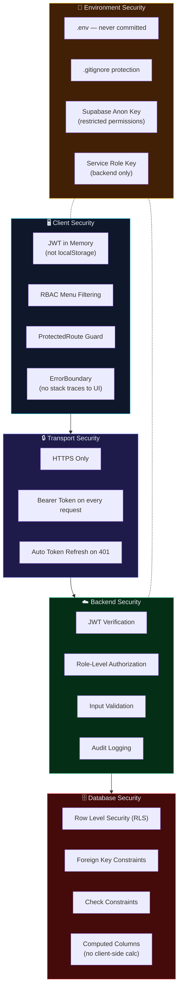

# 10 — Security Architecture

> Defence-in-depth security controls across all layers.

---

## 10.1 Security Overview



---

## 10.2 Authentication Security

| Control | Implementation |
|---------|---------------|
| **Token Storage** | JWT stored in React state (memory only) — **not** `localStorage` or cookies |
| **Token Lifetime** | Managed by Supabase Auth (default 1 hour) |
| **Token Refresh** | Automatic refresh before expiry via `refreshToken()` |
| **No Public Signup** | Users can only be created by L3 Managers through Edge Function |
| **Temp Passwords** | Expire after 24 hours, one-time use, hashed in `temp_credentials` |
| **Session Validation** | `getCurrentSession()` called on app mount to revalidate |
| **Auth State Listener** | `onAuthStateChange()` detects sign-out from other tabs |

---

## 10.3 Authorization (RBAC)

### Application-Level Guards

```typescript
// 1. Menu filtering — only show permitted items
const getMenuItems = () => {
    if (userRole === 'L3') items.push('users');      // L3 only
    if (hasMinimumRole(userRole, 'L2')) items.push('stock-movement'); // L2+
    return items;
};

// 2. ProtectedRoute HOC
<ProtectedRoute requiredRole="L3">
    <UserManagement />
</ProtectedRoute>

// 3. Hook-level checks
const { data } = useRoleAccess('L2'); // returns null if insufficient role
```

### Database-Level Guards (RLS)

```sql
-- Example: Only active users can read items
CREATE POLICY "items_read_policy" ON public.items
    FOR SELECT
    USING (
        EXISTS (
            SELECT 1 FROM public.profiles
            WHERE profiles.id = auth.uid()
            AND profiles.is_active = true
        )
    );

-- Example: Only L3 can modify profiles
CREATE POLICY "profiles_update_policy" ON public.profiles
    FOR UPDATE
    USING (
        EXISTS (
            SELECT 1 FROM public.profiles
            WHERE profiles.id = auth.uid()
            AND profiles.role = 'L3'
        )
    );
```

---

## 10.4 Audit Logging

Two audit tables provide complete activity tracking:

### `audit_log` (v1 — Application Level)

```sql
CREATE TABLE audit_log (
    id uuid PRIMARY KEY,
    user_id uuid NOT NULL,
    action varchar NOT NULL,      -- 'CREATE', 'UPDATE', 'DELETE', 'LOGIN', etc.
    target_type varchar,          -- 'item', 'user', 'order', etc.
    target_id varchar,            -- ID of affected record
    old_value jsonb,              -- Previous state
    new_value jsonb,              -- New state
    ip_address varchar,
    user_agent text,
    created_at timestamptz
);
```

### `audit_logs` (v2 — Enhanced)

```sql
CREATE TABLE audit_logs (
    id uuid PRIMARY KEY,
    user_id uuid REFERENCES profiles(id),
    action varchar NOT NULL,
    table_name varchar,           -- Which table was affected
    record_id uuid,               -- Which record was affected
    old_values jsonb,             -- Full previous row
    new_values jsonb,             -- Full new row
    performed_by uuid REFERENCES profiles(id),
    ip_address inet,
    user_agent text,
    success boolean DEFAULT true,
    error_message text,           -- Capture failed operations
    created_at timestamptz
);
```

### Logged Events
| Event | Action Value | Details Captured |
|-------|-------------|------------------|
| User login | `LOGIN` | Email, success/failure |
| User created | `CREATE_USER` | New user profile |
| Role changed | `UPDATE_ROLE` | Old role → new role |
| Item created | `CREATE_ITEM` | Item details |
| Item deleted | `DELETE_ITEM` | Deleted item data |
| Stock movement | `STOCK_IN` / `STOCK_OUT` | Qty, balance, reason |
| Password change | `PASSWORD_CHANGE` | User ID only |
| Packing created | `PACKING_CREATED` | Item code, movement number, approved qty |
| Box added | `BOX_CREATED` | Box number, qty, PKG ID |
| Sticker printed | `STICKER_PRINTED` | Box details, PKG ID |
| Stock transferred | `STOCK_PARTIAL_TRANSFER` / `STOCK_FULL_TRANSFER` | Transferred qty, box count |
| Packing completed | `PACKING_COMPLETED` | Total packed qty, box count |

---

## 10.5 Data Protection

| Concern | Control |
|---------|---------|
| **Environment Variables** | Stored in `.env` file, loaded via Vite's `import.meta.env` |
| **Git Protection** | `.gitignore` excludes `.env`, `node_modules/`, build artifacts |
| **Supabase Keys** | `VITE_SUPABASE_URL` and `VITE_SUPABASE_ANON_KEY` — anon key has restricted RLS permissions |
| **Service Role Key** | Used only in Edge Functions (server-side), never exposed to client |
| **Email Validation** | Database-level regex check constraint on `profiles.email` |
| **Input Validation** | Client-side + service-level validation before database writes |
| **Error Handling** | `ErrorBoundary` catches render errors; no stack traces shown to users |
| **Cascading Deletes** | Foreign key constraints prevent orphaned records |

---

## 10.6 Security Checklist

| # | Control | Status |
|---|---------|--------|
| 1 | JWT tokens not in localStorage | ✅ |
| 2 | No public signup endpoint | ✅ |
| 3 | Role-based menu filtering | ✅ |
| 4 | ProtectedRoute component guards | ✅ |
| 5 | Row Level Security enabled | ✅ |
| 6 | Audit logging for mutations | ✅ |
| 7 | Environment variables in .env | ✅ |
| 8 | .gitignore covers sensitive files | ✅ |
| 9 | Error boundary prevents stack leaks | ✅ |
| 10 | Input validation on forms | ✅ |
| 11 | Auto token refresh on 401 | ✅ |
| 12 | Temporary passwords expire in 24h | ✅ |
| 13 | Mutable search path fixed on all functions | ✅ |
| 14 | Packing audit log tracks all packing operations | ✅ |

---

**← Previous**: [09-MODULE-BREAKDOWN.md](./09-MODULE-BREAKDOWN.md) | **Next**: [11-DEPLOYMENT-ARCHITECTURE.md](./11-DEPLOYMENT-ARCHITECTURE.md) →

---

© 2026 AutoCrat Engineers. All rights reserved.
