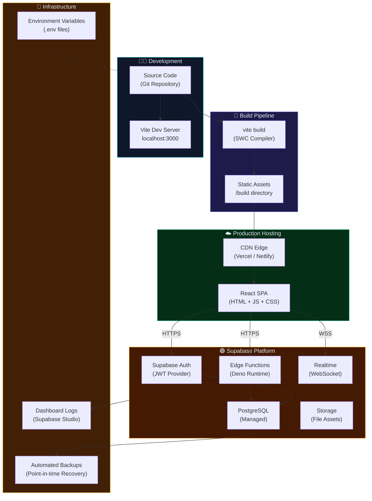
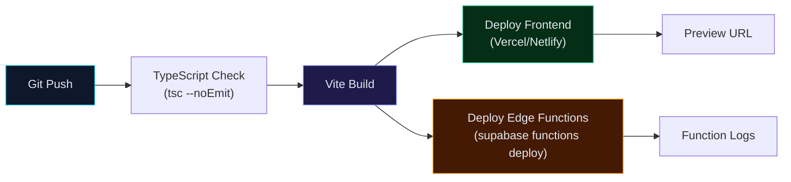

# 11 — Deployment Architecture

> Build pipeline, hosting, CDN, environment strategy, and infrastructure.

---

## 11.1 Deployment Topology



---

## 11.2 Build Configuration

### Vite Configuration (`vite.config.ts`)

```typescript
export default defineConfig({
    plugins: [react()],          // @vitejs/plugin-react-swc
    define: {
        __APP_VERSION__: JSON.stringify(packageJson.version),
    },
    build: {
        target: 'esnext',        // Modern browser output
        outDir: 'build',         // Output directory
    },
    server: {
        port: 3000,              // Dev server port
        open: true,              // Auto-open browser
    },
});
```

### Build Commands

| Command | Purpose | Output |
|---------|---------|--------|
| `npm run dev` | Start development server | `localhost:3000` with HMR |
| `npm run build` | Production build | `/build` directory with optimized assets |

### Build Output

```
build/
├── index.html              ← Entry point
├── assets/
│   ├── index-[hash].js     ← Bundled JavaScript
│   ├── index-[hash].css    ← Bundled CSS
│   └── vendor-[hash].js    ← Vendor chunk
└── logo.png                ← Static assets
```

---

## 11.3 Environment Strategy

### Environment Variables

| Variable | Scope | Purpose |
|----------|-------|---------|
| `VITE_SUPABASE_URL` | Client | Supabase project URL |
| `VITE_SUPABASE_ANON_KEY` | Client | Public API key (RLS-protected) |
| `SUPABASE_SERVICE_ROLE_KEY` | Server only | Admin key for Edge Functions |
| `SUPABASE_JWT_SECRET` | Server only | JWT verification secret |

### Environment Files

| File | Purpose | Committed? |
|------|---------|-----------|
| `.env` | Local development variables | ❌ Never |
| `.env.local` | Developer-specific overrides | ❌ Never |
| `.env.production` | Production variables | ❌ Never |
| `.env.example` | Template with placeholder values | ✅ Yes |

---

## 11.4 Supabase Edge Function Deployment

```bash
# Install Supabase CLI
npm install -g supabase

# Login to Supabase
supabase login

# Link local project to Supabase project
supabase link --project-ref <project-id>

# Deploy Edge Functions
supabase functions deploy server --verify-jwt

# Check function logs
supabase functions logs server
```

### Edge Function Configuration

| Setting | Value |
|---------|-------|
| **Runtime** | Deno (latest) |
| **Framework** | Hono |
| **JWT Verify** | Enabled (--verify-jwt) |
| **Entry Point** | `src/supabase/functions/server/index.tsx` |
| **Region** | Deployed to nearest Supabase Edge location |

---

## 11.5 Frontend Hosting Options

| Platform | Config | Notes |
|----------|--------|-------|
| **Vercel** | `vercel.json` with SPA rewrite | Zero-config for Vite projects |
| **Netlify** | `_redirects` file with `/* /index.html 200` | Drag-and-drop deployment |
| **Cloudflare Pages** | Build command: `npm run build`, output: `build` | Edge-delivered globally |
| **Firebase Hosting** | `firebase.json` with rewrite rules | Google Cloud infrastructure |

### Vercel Configuration Example

```json
{
    "rewrites": [
        { "source": "/(.*)", "destination": "/index.html" }
    ],
    "headers": [
        {
            "source": "/assets/(.*)",
            "headers": [
                { "key": "Cache-Control", "value": "public, max-age=31536000, immutable" }
            ]
        }
    ]
}
```

---

## 11.6 Database Management

| Operation | Tool | Command |
|-----------|------|---------|
| **Schema Migrations** | Supabase CLI | `supabase db push` |
| **Backup** | Supabase Dashboard | Automated daily + PITR |
| **Restore** | Supabase Dashboard | Point-in-time recovery |
| **SQL Editor** | Supabase Studio | Browser-based SQL execution |
| **Schema Dump** | Supabase CLI | `supabase db dump --schema public` |

---

## 11.7 CI/CD Pipeline (Recommended)



---

**← Previous**: [10-SECURITY-ARCHITECTURE.md](./10-SECURITY-ARCHITECTURE.md) | **Next**: [12-DIRECTORY-STRUCTURE.md](./12-DIRECTORY-STRUCTURE.md) →

---

© 2026 AutoCrat Engineers. All rights reserved.
